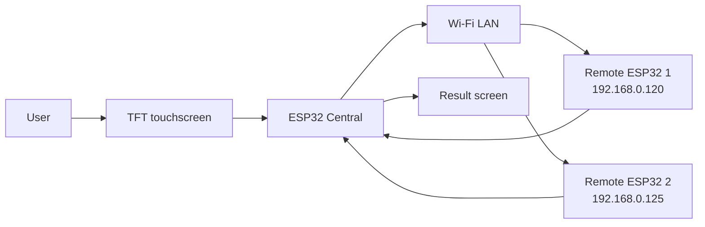
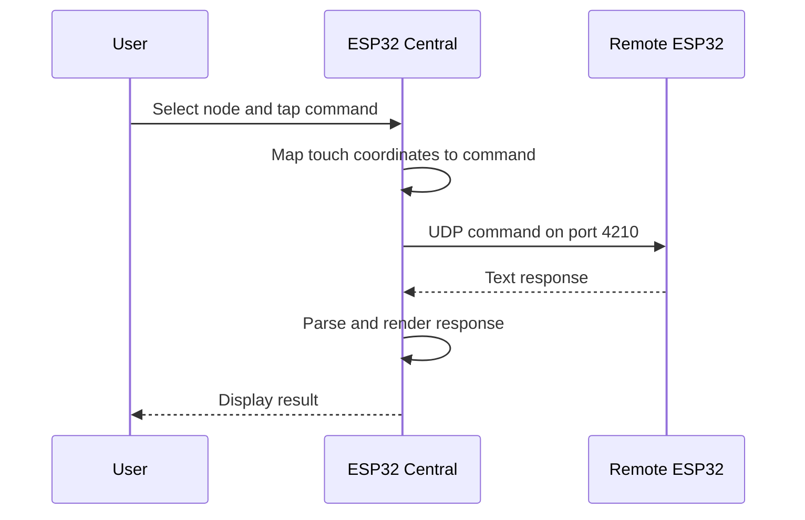
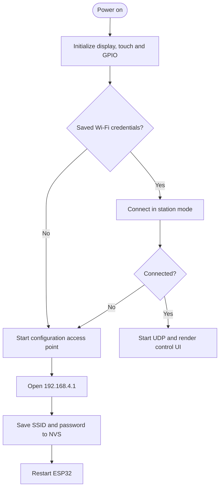

# ESP32 Central

<div align="center">


</div>

A touchscreen-based ESP32 control center for monitoring and commanding remote ESP32 nodes over a local Wi-Fi network. The firmware combines a TFT/XPT2046 interface, UDP communication, local diagnostics, and an automatic Wi-Fi configuration portal.

## Contents

- [Overview](#overview)
- [Architecture](#architecture)
- [Hardware](#hardware)
- [Software](#software)
- [Command protocol](#command-protocol)
- [Installation](#installation)
- [Network configuration](#network-configuration)
- [Troubleshooting](#troubleshooting)

## Overview

The central controller can:

- select `ESP1` or `ESP2` as the target node
- send control and diagnostic commands over UDP
- display responses on a 2.8-inch touchscreen
- execute supported commands locally
- store Wi-Fi credentials in ESP32 NVS storage
- start a fallback access point when no saved network is available
- control the local LED and auxiliary output

## Architecture



### Command and response flow



### Startup and configuration flow



## Hardware

### Required components

- ESP32 development board
- 2.8-inch SPI TFT display
- XPT2046 touch controller
- LED connected to GPIO 4
- auxiliary output connected to GPIO 21
- USB or 5 V power supply
- local Wi-Fi network

### Pin mapping

| Function | GPIO | Description |
| --- | ---: | --- |
| Touch CLK | 25 | XPT2046 SPI clock |
| Touch MISO | 39 | XPT2046 SPI input |
| Touch MOSI | 32 | XPT2046 SPI output |
| Touch CS | 33 | XPT2046 chip select |
| Status LED | 4 | Local LED control |
| Auxiliary output | 21 | Additional digital output |

### Wiring overview

```text
                         +----------------------+
                         |        ESP32         |
                         |                      |
    XPT2046 CLK  ------> | GPIO 25              |
    XPT2046 MISO ------> | GPIO 39              |
    XPT2046 MOSI ------> | GPIO 32              |
    XPT2046 CS   ------> | GPIO 33              |
    Status LED   ------> | GPIO 4               |
    Auxiliary    ------> | GPIO 21              |
                         +----------+-----------+
                                    |
                              Wi-Fi LAN
                         +----------+-----------+
                         |                      |
                 +-------+-------+      +-------+-------+
                 | Remote ESP32  |      | Remote ESP32  |
                 | 192.168.0.120 |      | 192.168.0.125 |
                 +---------------+      +---------------+
```

> Confirm the display controller's pinout before wiring. The display SPI configuration is handled by `TFT_eSPI`; the touch controller uses the pins listed above.

## Software

The project is implemented in [`Mestre_2.ino`](./Mestre_2.ino) and uses:

- `TFT_eSPI` for display rendering
- `XPT2046_Touchscreen` for touch input
- `WiFi` for network connectivity
- `WiFiUdp` for command transport
- `WebServer` for the configuration portal
- `Preferences` for persistent Wi-Fi settings

### Main firmware responsibilities

| Function | Responsibility |
| --- | --- |
| `setup()` | Initialize hardware, Wi-Fi, UDP and the user interface |
| `loop()` | Process touch input, UDP packets and LED blinking |
| `processarClique()` | Detect target and command button selections |
| `enviarComandoUDP()` | Send a command to the selected remote node |
| `verificarMensagensUDP()` | Receive and process UDP responses |
| `executa_comando_local()` | Execute supported commands on the central ESP32 |
| `iniciarPortal()` | Start the Wi-Fi configuration access point |
| `salvarWifi()` | Persist credentials and restart the board |

## Command protocol

Commands are plain-text UDP packets sent to port `4210`.

| Command | Purpose |
| --- | --- |
| `LED_ON` | Turn on the target LED |
| `LED_OFF` | Turn off the target LED |
| `LED_BLINK:500` | Blink the LED every 500 ms |
| `TEMP` | Read CPU temperature |
| `CPU` | Read chip model, revision, cores and frequency |
| `RAM` | Read heap information |
| `FLASH` | Read flash capacity, speed and sketch size |
| `INIT` | Read the reset reason |
| `UPTIME` | Read uptime in milliseconds |
| `MAC` | Read the MAC address |
| `NET_INFO` | Read IP, gateway, subnet mask and RSSI |
| `RESET_WIFI` | Clear saved Wi-Fi credentials and restart |

### Example client

```python
import socket

HOST = "192.168.0.120"
PORT = 4210

with socket.socket(socket.AF_INET, socket.SOCK_DGRAM) as sock:
    sock.settimeout(3)
    sock.sendto(b"TEMP", (HOST, PORT))
    response, address = sock.recvfrom(1024)
    print(f"{address}: {response.decode().strip()}")
```

## Touchscreen interface

The main screen provides target selection and 12 actions:

```text
+------------------------------------------------+
|              CENTRAL HIBRIDA TOTAL            |
+----------------------+-------------------------+
|      ESP 1 (120)     |       ESP 2 (125)       |
+----------+-----------+-----------+-------------+
| LED ON   | LED OFF   | BLINK     | VER TEMP    |
+----------+-----------+-----------+-------------+
| INFO CPU | RAM FREE  | FLASH INF | RST MOTIV   |
+----------+-----------+-----------+-------------+
| UPTIME   | END MAC   | REDE INFO | RST WIFI    |
+----------+-----------+-----------+-------------+
```

A response screen displays returned text. Touching the screen returns to the main interface.

## Installation

### Arduino IDE

1. Install the ESP32 board package.
2. Install `TFT_eSPI` and `XPT2046_Touchscreen` through the Library Manager.
3. Configure `TFT_eSPI/User_Setup.h` for the connected display:

```cpp
#define TFT_MOSI 23
#define TFT_MISO 19
#define TFT_SCLK 18
#define TFT_CS   15
#define TFT_DC   2
```

4. Open `Mestre_2.ino`.
5. Select the appropriate ESP32 board, such as **ESP32 Dev Module**.
6. Compile and upload the sketch.
7. Open the serial monitor at `115200` baud when diagnosing startup behavior.

## Network configuration

### Normal operation

The controller reads the SSID and password from the `wifi` NVS namespace. When the connection succeeds, it starts UDP on port `4210` and displays the main control interface.

### First-time configuration

If credentials are missing or the connection cannot be established:

1. Connect to the access point `ESP32_CENTRAL_CONFIG`.
2. Open `http://192.168.4.1`.
3. Enter the network SSID and password.
4. Save the form.
5. Wait for the ESP32 to restart and connect.

### Remote node addresses

```text
ESP1: 192.168.0.120
ESP2: 192.168.0.125
UDP port: 4210
```

Update these values in the firmware if your network uses different addresses.

## Troubleshooting

### Display is blank

- verify the TFT wiring and `TFT_eSPI` configuration
- confirm the display driver is correct
- test the display with a library example

### Touch input does not work

- verify XPT2046 pins and chip select
- check the touch rotation setting
- recalibrate the coordinate mapping in `loop()`
- confirm the pressure threshold is appropriate for the panel

### Wi-Fi does not connect

- verify the SSID and password
- move the board closer to the access point
- use the `ESP32_CENTRAL_CONFIG` fallback network
- clear credentials with `RESET_WIFI` when necessary

### UDP commands do not work

- confirm both devices are on the same LAN
- verify the destination IP and UDP port `4210`
- check firewall or client-isolation settings on the router
- test the node with the Python example above

## Security notes

- UDP is connectionless and unauthenticated; use this project only on a trusted network.
- The configuration portal is intended for local setup and should not be exposed to an untrusted network.
- Avoid committing real Wi-Fi credentials to source control.

## License

This project is distributed under the MIT License. See [`LICENSE`](./LICENSE) for details.

## Author

**Paulo Marques**  
[GitHub: @paulocfmarques-collab](https://github.com/paulocfmarques-collab)

## Support

For questions, bugs or feature requests, please [open an issue](https://github.com/paulocfmarques-collab/esp32_central/issues).
