# ESP32 Central

<div align="center">


</div>

A robust, hybrid control system built around the ESP32 as a smart central node. It provides local human-machine interaction via a TFT touchscreen, remote device orchestration over Wi-Fi using UDP, and automatic fallback configuration when no saved network is available.

The system is designed for distributed IoT control scenarios where one central controller can monitor or command multiple remote ESP32 devices in a local network.

## Overview

This project implements a control panel that:

- selects a target remote device (`ESP1` or `ESP2`)
- sends commands through UDP to the selected node
- displays live command results on a local touchscreen
- exposes a Wi-Fi configuration portal if no known network is configured
- persists Wi-Fi credentials in ESP32 NVS memory
- monitors local system health and remote device state

## System Architecture

```mermaid
flowchart LR
    A[User / Touch Panel] --> B[ESP32 Central]
    B --> C[TFT 2.8" Touchscreen]
    B --> D[Wi-Fi STA / AP]
    B --> E[UDP Command Engine]
    D --> F[Remote ESP32 Node 1]
    D --> G[Remote ESP32 Node 2]
    E --> H[Local Diagnostics / Status]
    F --> I[Payload Response]
    G --> I
    I --> B
    B --> J[Result Screen]
```

## Functional Data Flow

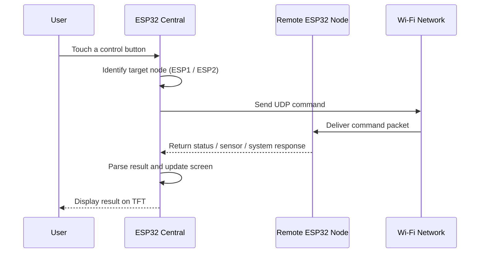

## Conceptual Hardware Layout

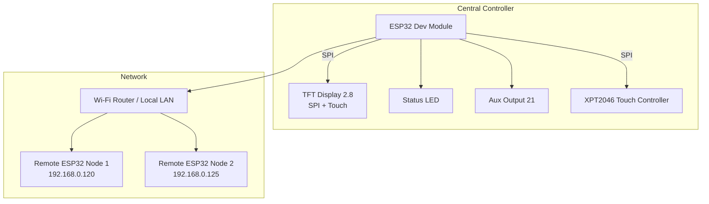

## Conceptual Wiring Overview

```text
                         +-------------------------+
                         |        ESP32           |
                         |                         |
          TFT Display ----> | MOSI 32  MISO 39       |
          Touch Controller -> | CS 33   CLK 25         |
          Status LED ------> | GPIO 4                 |
          Auxiliary Output -> | GPIO 21                |
                         +-------------------------+
                                  |
                                  +------ Wi-Fi LAN / Router
                                             |
                     +-----------------------+-----------------------+
                     |                                               |
              +------+--------+                              +------+--------+
              | ESP32 Node 1  |                              | ESP32 Node 2  |
              | 192.168.0.120 |                              | 192.168.0.125 |
              +---------------+                              +---------------+
```

## Core Features

### Touch interface

- 2.8" TFT display with touch interaction
- compact command matrix with 12 actions
- target selector for `ESP 1` and `ESP 2`
- result screen with live feedback

### Wi-Fi management

- Wi-Fi station mode for normal operation
- automatic access point fallback for first-time configuration
- saved credentials stored using `Preferences` (NVS)
- restart recovery after configuration changes

### Remote control via UDP

- low-latency, simple command exchange
- remote endpoint selection by IP
- support for local and remote command execution

### Local diagnostics

The central controller can report:

- chip model and revision
- core count and CPU frequency
- free heap and minimum heap
- flash size and speed
- sketch size
- reset cause
- uptime
- MAC address
- IP, gateway, subnet mask, and RSSI
- temperature

## Hardware Requirements

### Recommended hardware

- ESP32 development board
- 2.8" TFT display with SPI interface
- XPT2046 touch controller
- LED connected to GPIO 4
- 5V power source or USB supply
- local Wi-Fi network

### Typical pin mapping

| Function | Pin | Description |
| --- | --- | --- |
| XPT2046 CLK | 25 | Touch SPI clock |
| XPT2046 MISO | 39 | Touch SPI input |
| XPT2046 MOSI | 32 | Touch SPI output |
| XPT2046 CS | 33 | Touch chip select |
| LED | 4 | Status indicator |
| Output | 21 | Auxiliary output |

## Software Architecture

The firmware is structured around a few core responsibilities:

- display rendering and user interaction
- local Wi-Fi setup and configuration portal
- UDP packet transmission and reception
- command dispatch and state control
- result screen rendering

### Main logic blocks

- `setup()`: board initialization, Wi-Fi connection, UI bootstrap
- `loop()`: input polling, UDP monitoring, blink state updates
- `processarClique()`: touch event handling and action triggering
- `enviarComandoUDP()`: sends the selected command to the remote node
- `verificarMensagensUDP()`: receives and handles UDP responses
- `executa_comando_local()`: interprets local device commands
- `desenharInterface()`: renders the main control interface
- `desenharTelaResposta()`: renders result information on screen

## Command Set

The system uses simple UDP text commands. A command is sent to the selected target node and the response is rendered back to the display.

| Command | Description | Typical Response |
| --- | --- | --- |
| `LED_ON` | Turn on the selected device LED | status confirmation |
| `LED_OFF` | Turn off the selected device LED | status confirmation |
| `LED_BLINK:500` | Start LED blink with a given interval | blink status |
| `TEMP` | Read CPU temperature | temperature value |
| `CPU` | Read CPU details | model, revision, cores, frequency |
| `RAM` | Read RAM usage | free heap and minimum heap |
| `FLASH` | Read flash memory information | size and speed |
| `INIT` | Read reset reason | reason code |
| `UPTIME` | Read uptime | time in milliseconds |
| `MAC` | Read MAC address | device MAC |
| `NET_INFO` | Read network status | IP, gateway, mask, RSSI |
| `RESET_WIFI` | Clear saved Wi-Fi credentials | device restart |

## Network Configuration

### Standard operation

When Wi-Fi credentials are saved, the ESP32 connects to the network in station mode and runs as a normal controller.

### First-time or recovery mode

If no valid configuration is available, the ESP32 starts an access point:

- SSID: `ESP32_CENTRAL_CONFIG`
- IP: `192.168.4.1`

The user connects to this network and opens the configuration page to provide the SSID and password.

## Typical Remote Device Setup

```text
ESP32 Central (Controller)
      |
      +--> ESP1: 192.168.0.120
      |
      +--> ESP2: 192.168.0.125
```

This allows a single central panel to inspect or control multiple nodes throughout the local network.

## Example UDP Communication

```python
import socket

sock = socket.socket(socket.AF_INET, socket.SOCK_DGRAM)
message = "TEMP"

sock.sendto(message.encode(), ("192.168.0.120", 4210))
data, _ = sock.recvfrom(1024)
print(data.decode())

sock.close()
```

## Main Display Layout

```text
┌──────────────────────────────────────────────────────────────┐
│ CENTRAL HIBRIDA TOTAL                                        │
├───────────────────────────┬──────────────────────────────────┤
│ ESP 1 (120)              │ ESP 2 (125)                       │
├───────────┬───────────┬───┼───────────┬───────────┬────────┤
│ LED ON    │ LED OFF   │ BLINK │ VER TEMP  │ INFO CPU  │ RAM    │
├───────────┼───────────┼──────┼───────────┼───────────┼────────┤
│ FLASH INF │ RST MOTIV │ UPTIME │ END MAC  │ REDE INFO │ RST WIFI │
└───────────┴───────────┴──────┴───────────┴───────────┴────────┘
```

## Installation Guide

### 1. Install the required libraries

Install the following libraries in the Arduino IDE or PlatformIO environment:

- `TFT_eSPI`
- `XPT2046_Touchscreen`
- Wi-Fi libraries bundled with ESP32 core
- `Preferences`

### 2. Configure the TFT display driver

Update the `User_Setup.h` file in `TFT_eSPI` to match your display wiring.

### 3. Upload the firmware

1. Select your ESP32 board in the Arduino IDE
2. Set upload speed to `921600`
3. Compile the sketch
4. Upload the code to the device
5. Configure Wi-Fi through the AP portal if needed

## Troubleshooting

### Display not visible

- verify the SPI pin mapping
- confirm the TFT display is supported by `TFT_eSPI`
- test with a minimal example from the library

### Touch not responding

- recalibrate touch mapping values
- verify the XPT2046 pins
- confirm touch pressure threshold (`z > 150`)

### Wi-Fi not connecting

- confirm SSID and password are correct
- check RF coverage and signal strength
- use the AP fallback portal to reconfigure the network

### UDP commands failing

- verify the remote IP addresses
- validate UDP port `4210`
- test connectivity using a UDP tool or packet sniffer

## Project Summary

This project provides a practical example of an intelligent ESP32-based control center for distributed local automation. It combines:

- human interface design
- embedded firmware control logic
- network communications
- resilience and recovery mechanisms
- remote system diagnostics

It is suitable for IoT dashboards, local control panels, machine status monitors, and distributed automation systems.

## License

This project is distributed under the MIT License. See the `LICENSE` file for details.

## Author

Paulo Marques

- GitHub: [@paulocfmarques-collab](https://github.com/paulocfmarques-collab)

## Contributions

Contributions are welcome. To propose an enhancement:

1. Fork the repository
2. Create a feature branch
3. Commit your changes
4. Push the branch
5. Open a pull request

## Support

For questions, bug reports, or feature requests, open an issue in this repository.

---

Developed for distributed ESP32 automation and local control systems.


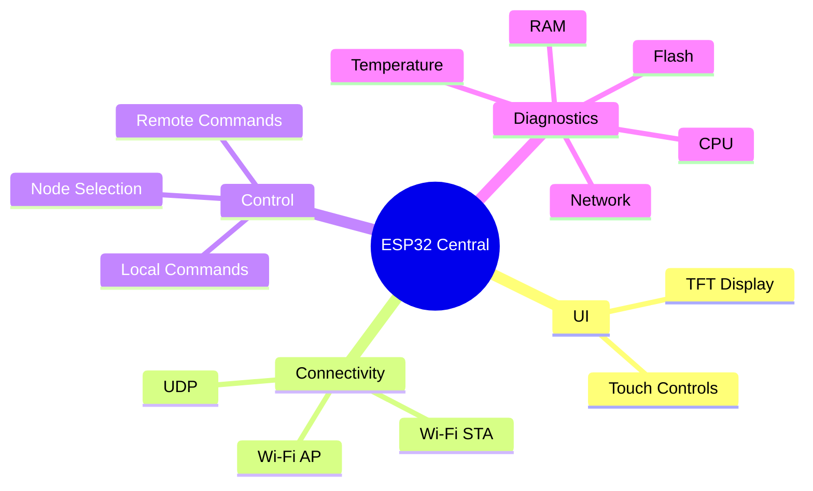


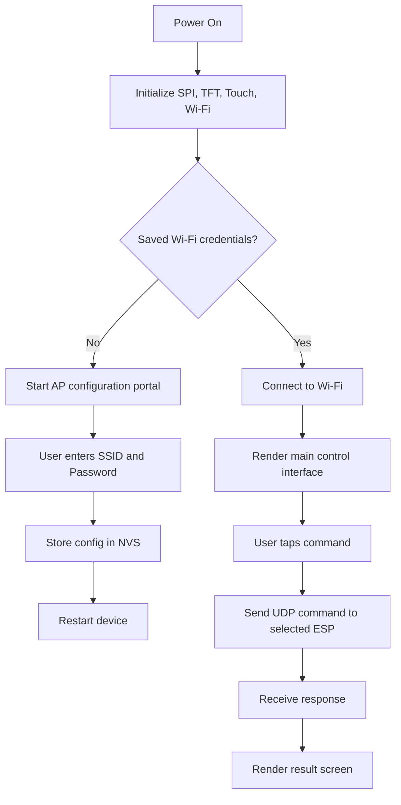


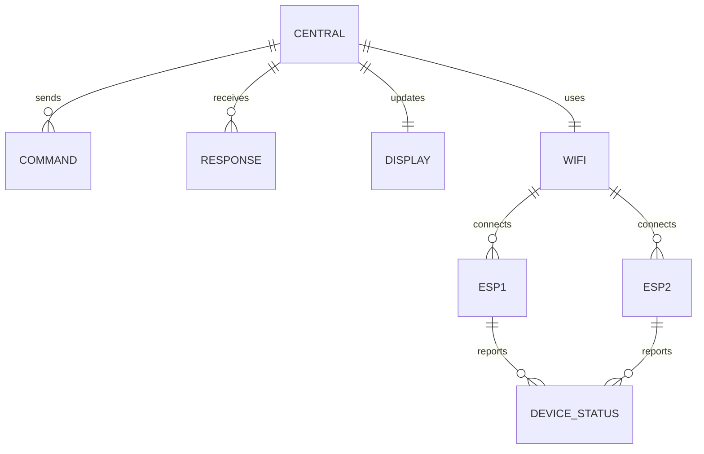


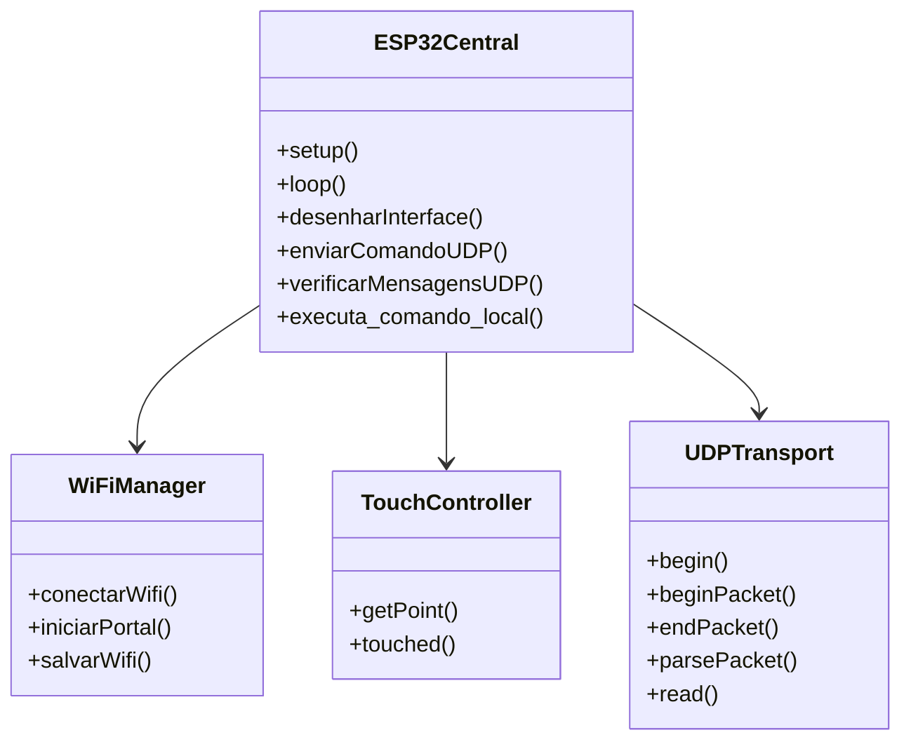


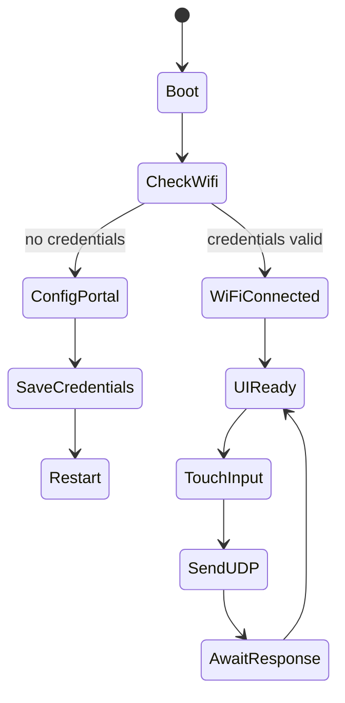


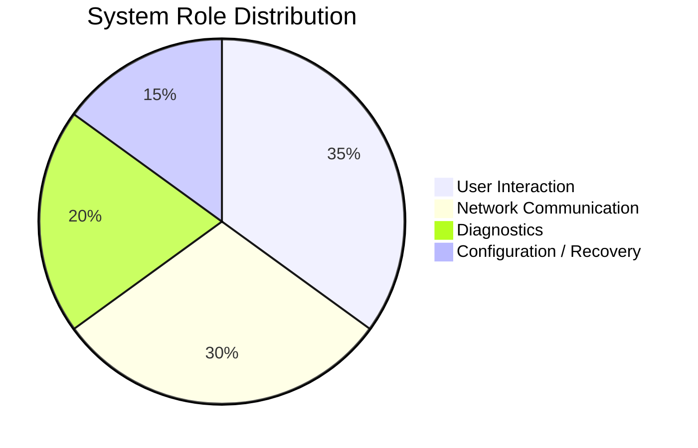


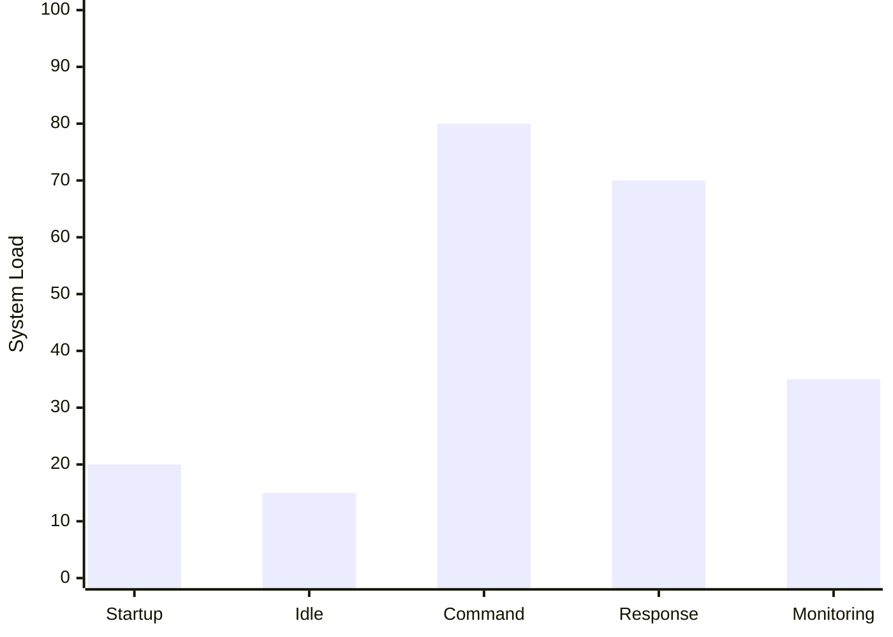


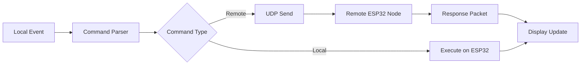


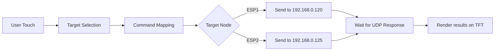


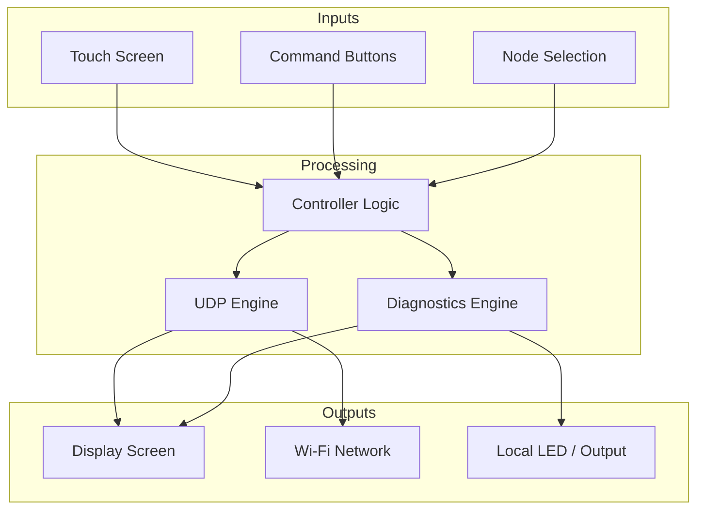


```text
Sensor / Device Layer          Control Layer                Presentation Layer
+------------------+          +-------------------+       +----------------------+
| Remote ESP32     |  --->   | UDP Commands      |  ---> | TFT Display          |
| Node 1 / Node 2  |         | State Handling    |       | Touch Interaction    |
| Local LED / I/O  |         | Diagnostics       |       | Result Screens       |
+------------------+         +-------------------+       +----------------------+
```


```markdown
Project architecture summary:
- local HMI via TFT touch interface
- remote control through Wi-Fi UDP packets
- automatic configuration portal for recovery
- robust command dispatch and monitoring
- distributed node selection with multi-device orchestration
```


```bash
# Example local validation flow
1. Power up the ESP32
2. Connect to configured Wi-Fi
3. Select target node
4. Press a command button
5. Observe result in the TFT screen
```


```diff
+ Professional README structure
+ Architecture diagrams and flow views
+ Wiring overview and command reference
+ Setup, troubleshooting, and support sections
+ Clear project explanation for maintainers and users
```


```text
End-to-end operation:
User input -> Touch handler -> Command parser -> UDP packet -> Remote ESP32 -> Response -> Display update
```


```markdown
This README was intentionally redesigned to be presentation-ready for GitHub and technical audiences.
```
