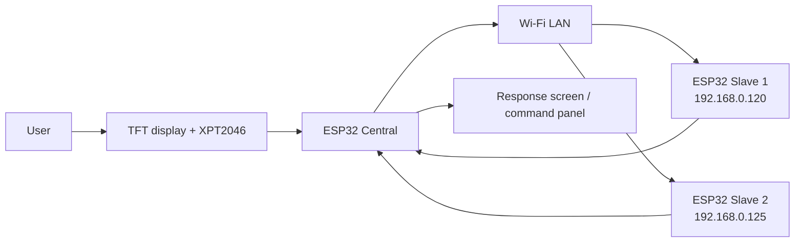
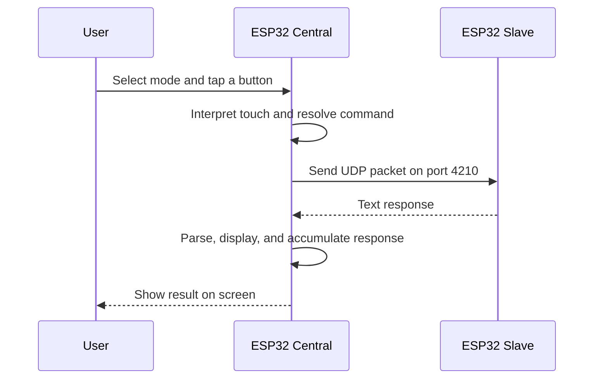
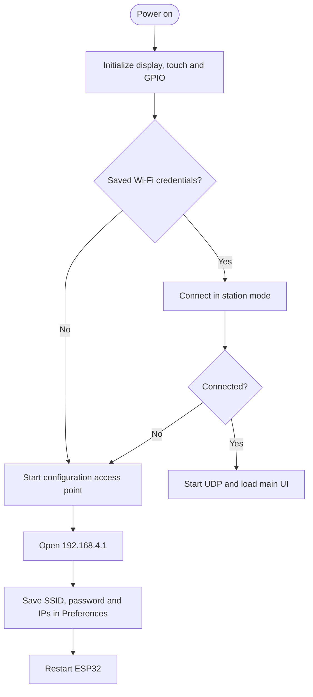

# ESP32 Central

<div align="center">


</div>

A touchscreen-based ESP32 control center for monitoring and controlling remote ESP32 nodes over a local Wi‑Fi network. The firmware combines a TFT display, XPT2046 touch input, UDP communication, Wi‑Fi configuration portal, NTP time sync, OTA updates, and a local/remote command interface in a single project.

## Contents

- [Overview](#overview)
- [Architecture](#architecture)
- [Project structure](#project-structure)
- [Hardware](#hardware)
- [Software and modules](#software-and-modules)
- [Command protocol](#command-protocol)
- [Installation](#installation)
- [Network configuration](#network-configuration)
- [Usage](#usage)
- [Troubleshooting](#troubleshooting)
- [Security](#security)
- [License](#license)

## Overview

The central controller can:

- switch between `LOCAL` and `REMOTE` modes
- select `ESP 1` or `ESP 2` as the remote target
- send commands over UDP on port `4210`
- receive and display responses on a 320x240 TFT screen
- execute commands locally on the ESP32 master itself
- save Wi‑Fi credentials using `Preferences`
- start a fallback access point named `ESP32_CENTRAL_CONFIG`
- control the local LED and auxiliary output
- synchronize date/time using NTP
- apply network OTA updates

## Architecture


```mermaid
flowchart LR
    User[User] --> Touch[TFT display + XPT2046]
    Touch --> Central[ESP32 Central]
    Central --> WiFi[Wi‑Fi LAN]
    WiFi --> Node1[ESP32 Slave 1<br/>192.168.0.120]
    WiFi --> Node2[ESP32 Slave 2<br/>192.168.0.125]
    Node1 --> Central
    Node2 --> Central
    Central --> Display[Response screen / command panel]
```

### Command and response flow


```mermaid
sequenceDiagram
    participant U as User
    participant C as ESP32 Central
    participant R as ESP32 Slave

    U->>C: Select mode and tap a button
    C->>C: Interpret touch and resolve command
    C->>R: Send UDP packet on port 4210
    R-->>C: Text response
    C->>C: Parse, display, and accumulate response
    C-->>U: Show result on screen
```

### Startup and configuration flow


```mermaid
flowchart TD
    Start([Power on]) --> Init[Initialize display, touch and GPIO]
    Init --> Credentials{Saved Wi‑Fi credentials?}
    Credentials -- Yes --> Connect[Connect in station mode]
    Credentials -- No --> Portal[Start configuration access point]
    Connect --> Connected{Connected?}
    Connected -- Yes --> Ready[Start UDP and load main UI]
    Connected -- No --> Portal
    Portal --> Configure[Open 192.168.4.1]
    Configure --> Save[Save SSID, password and IPs in Preferences]
    Save --> Restart[Restart ESP32]
```

## Project structure

The main files in this repository are:

- `Central.ino` — firmware entry point
- `Display.h` / `Display.cpp` — TFT abstraction layer
- `InterfaceCentral.h` / `InterfaceCentral.cpp` — main interface, buttons, and touch handling
- `WifiConfig.h` / `WifiConfig.cpp` — Wi‑Fi connection and configuration portal
- `UdpComm.h` / `UdpComm.cpp` — UDP communication with slave nodes
- `CommandHandler.h` — local command execution and OTA handling
- `NTPUtil.h` — time synchronization via NTP
- `Botao.h` — screen/button constants and definitions

## Hardware

### Required components

- ESP32 development board
- 2.8-inch SPI TFT display
- XPT2046 touch controller
- LED connected to GPIO 4
- auxiliary output on GPIO 21
- USB or 5V power supply
- local Wi‑Fi network

### Pin mapping

| Function | GPIO | Description |
| --- | ---: | --- |
| Touch CLK | 25 | XPT2046 SPI clock |
| Touch MISO | 39 | Touch serial input |
| Touch MOSI | 32 | Touch serial output |
| Touch CS | 33 | XPT2046 chip select |
| Status LED | 4 | Local central LED |
| Auxiliary output | 21 | Additional digital output |

### Wiring overview

```text
                         +----------------------+
                         |        ESP32         |
                         |                      |
    XPT2046 CLK  ------> | GPIO 25              |
    XPT2046 MISO ------> | GPIO 39              |
    XPT2046 MOSI ------> | GPIO 32              |
    XPT2046 CS   ------> | GPIO 33              |
    Status LED   ------> | GPIO 4               |
    Auxiliary    ------> | GPIO 21              |
                         +----------+-----------+
                                    |
                              Wi‑Fi LAN
                         +----------+-----------+
                         |                      |
                 +-------+-------+      +-------+-------+
                 | ESP32 Slave    |      | ESP32 Slave    |
                 | 192.168.0.120 |      | 192.168.0.125 |
                 +---------------+      +---------------+
```

> Confirm the display driver and pinout before wiring the hardware.

## Software and modules

The firmware uses the following libraries and modules:

- `TFT_eSPI` for display rendering
- `XPT2046_Touchscreen` for touch input
- `WiFi` for network connectivity
- `WebServer` for the configuration portal
- `Preferences` for persistent Wi‑Fi and IP settings
- `WiFiUdp` for UDP command transport
- `ArduinoOTA` for over-the-air updates
- `time.h` and NTP for clock synchronization

### Main responsibilities

| Module | Responsibility |
| --- | --- |
| `setup()` | Initialize hardware, Wi‑Fi, UDP and the UI |
| `loop()` | Process touch, UDP packets, timers and LED states |
| `InterfaceCentral::escanearToque()` | Detect button press |
| `UdpComm::enviarComando()` | Send a command to the selected slave |
| `UdpComm::escutarResposta()` | Receive and classify incoming reply |
| `CommandHandler::executar()` | Execute local commands and handle responses |
| `WifiConfig::iniciarPortal()` | Start the configuration access point |
| `NTPUtil::initNTP()` | Synchronize the real-time clock |
| `OtaManager::inicializar()` | Configure OTA updates |

## Command protocol

The project uses plain-text UDP packets on port `4210`.

### Local commands executed by the central

| Command | Description |
| --- | --- |
| `LED_ON` | Turn on the local LED |
| `LED_OFF` | Turn off the local LED |
| `LED_BLINK:500` | Blink with the given interval in ms |
| `TEMP` | Read CPU temperature |
| `CPU` | Display model, cores and clock frequency |
| `RAM` | Show heap usage and free memory |
| `FLASH` | Display flash size and speed |
| `UPTIME` | Show runtime in milliseconds |
| `MAC` | Show MAC address |
| `NET_INFO` | Display IP, RSSI and SSID |
| `INFO` | Show full device information |
| `VERSION` | Firmware version |
| `BUILD` | Build date and time |
| `STATUS` | System status summary |
| `LASTCMD` | Last processed command |
| `CMDCOUNT` | Number of processed commands |
| `TIME` | Current time |
| `DATE` | Current date |
| `SET_FUSO:<value>` | Adjust local timezone |
| `SET_ESCRAVO1:<IP>` | Update slave 1 IP |
| `SET_ESCRAVO2:<IP>` | Update slave 2 IP |
| `RESET_WIFI` | Clear saved Wi‑Fi data and restart |
| `DESLIGAR` | Enter deep sleep |

### Remote commands sent to slave devices

The remote panel sends commands such as:

- `LED_ON`
- `LED_OFF`
- `LED_BLINK:1000`
- `TEMP`
- `CPU`
- `RAM`
- `INFO`
- `VERSION`
- `BUILD`
- `STATUS`
- `UPTIME`
- `NET_INFO`
- `CMDCOUNT`
- `LASTCMD`

### Example Python client

```python
import socket

HOST = "192.168.0.120"
PORT = 4210

with socket.socket(socket.AF_INET, socket.SOCK_DGRAM) as sock:
    sock.settimeout(3)
    sock.sendto(b"TEMP", (HOST, PORT))
    response, address = sock.recvfrom(1024)
    print(f"{address}: {response.decode().strip()}")
```

## Installation

### Arduino IDE

1. Install ESP32 support in the Arduino IDE.
2. Install the `TFT_eSPI` and `XPT2046_Touchscreen` libraries.
3. Configure `TFT_eSPI/User_Setup.h` for your display module.
4. Open `Central.ino`.
5. Select the appropriate ESP32 board, such as `ESP32 Dev Module`.
6. Compile and upload the sketch.
7. Open the serial monitor at `115200` baud to diagnose startup issues.

### Example display setup

```cpp
#define TFT_MOSI 23
#define TFT_MISO 19
#define TFT_SCLK 18
#define TFT_CS   15
#define TFT_DC   2
```

## Network configuration

### Normal operation

On boot, the central tries to read the SSID and password from the `wifi` namespace in `Preferences`.

If it connects successfully:

- it runs in station mode
- enables UDP on port `4210`
- shows the main central interface
- starts NTP synchronization after startup

### First-time configuration

If no Wi‑Fi credentials are saved, or connection fails:

1. Connect to the access point `ESP32_CENTRAL_CONFIG`
2. Open `http://192.168.4.1`
3. Enter the SSID, password and slave IPs
4. Save the settings
5. Wait for the ESP32 to restart and reconnect

### Slave addresses

```text
ESP1: 192.168.0.120
ESP2: 192.168.0.125
UDP port: 4210
```

> These values can also be changed via the configuration portal or through `SET_ESCRAVO1` and `SET_ESCRAVO2` commands.

## Usage

The main screen offers two initial modes:

- `LOCAL` — runs commands on the master device itself
- `REMOTE` — sends commands to the selected slave ESP32

After selecting a mode, the screen shows command pages with navigation controls. You can move between pages and return to the initial menu.

### Local mode

This panel includes diagnostics, network status, NTP, memory usage, temperature, and system management commands.

### Remote mode

In remote mode, the user selects `ESP 1` or `ESP 2`, then sends commands through UDP to the corresponding slave. When a response arrives, the central displays it on screen and returns to the main menu after about 7 seconds.

## Troubleshooting

### Screen stays blank

- verify the TFT wiring
- confirm the correct driver in `TFT_eSPI`
- test with a known working display example

### Touch is not working

- confirm the XPT2046 pins and chip select
- verify the touch rotation (`setRotation(1)`) 
- test pressure filtering and coordinate limits
- confirm the touch panel is correctly calibrated

### Wi‑Fi does not connect

- verify the SSID and password
- move the board closer to the router
- use the fallback AP `ESP32_CENTRAL_CONFIG`
- clear saved credentials with `RESET_WIFI`

### UDP commands do not work

- confirm both devices are on the same LAN
- verify the target IP and port `4210`
- check router firewall or client isolation rules
- test using the Python example above

### NTP does not synchronize

- verify internet access
- adjust the timezone using `SET_FUSO:<value>`
- ensure the ESP32 is already connected before the NTP attempt

## Security

- UDP is connectionless and does not authenticate the sender
- use the project only on trusted networks
- keep the configuration portal on a local network and do not expose it publicly
- avoid committing real credentials to public repositories

## License

This project is distributed under the MIT License. See [`LICENSE`](./LICENSE).

## Author

**Paulo Marques**  
[GitHub: @paulocfmarques-collab](https://github.com/paulocfmarques-collab)

## Support

For questions, bugs, or feature requests, please open an [issue](https://github.com/paulocfmarques-collab/esp32_central/issues).
