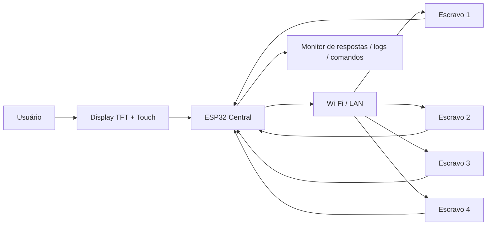
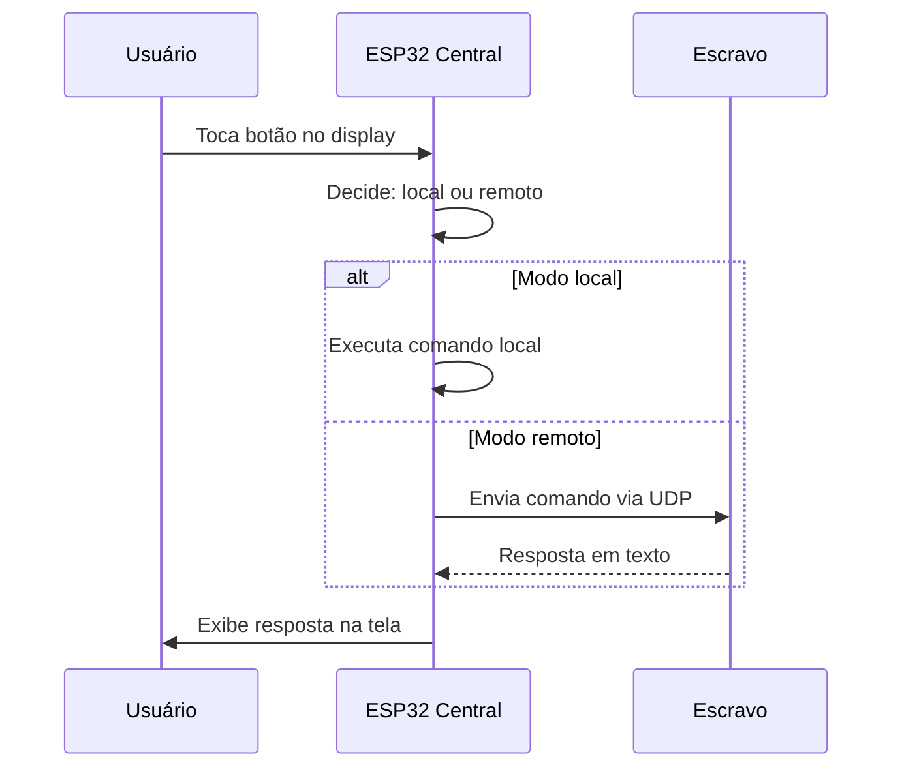

# ESP32 Central

<div align="center">


</div>

> Central de automação, monitoramento e comando para ESP32 com interface touchscreen, operação local/remota e integração com dispositivos esclavos em LAN.

## Visão geral

O projeto `ESP32 Central` funciona como uma central de controle para um ecossistema de ESP32s espalhados em rede local. A unidade principal oferece:

- interface gráfica em TFT touchscreen de 320x240;
- seleção de modo local ou remoto;
- envio de comandos via UDP para até 4 dispositivos esclavos;
- diagnósticos locais do próprio ESP32;
- portal Wi‑Fi para configuração inicial e recuperação de credenciais;
- sincronização de relógio via NTP;
- atualização OTA por rede;
- persistência de configuração em flash via `Preferences`;
- suporte a resposta em tela com scroll e auto-fechamento.

## Arquitetura do sistema


```mermaid
flowchart LR
    A[Usuário] --> B[Display TFT + Touch]
    B --> C[ESP32 Central]
    C --> D[Wi‑Fi / LAN]
    D --> E[Escravo 1]
    D --> F[Escravo 2]
    D --> G[Escravo 3]
    D --> H[Escravo 4]
    E --> C
    F --> C
    G --> C
    H --> C
    C --> I[Monitor de respostas / logs / comandos]
```

## Funcionalidades principais

### 1. Controle local e remoto
- Modo local: executa comandos diretamente na central.
- Modo remoto: envia comandos UDP para um alvo específico em rede.
- Suporte a múltiplos escravos com status visual de disponibilidade.

### 2. Interface touchscreen
- Menu principal em tela gráfica.
- Botões de navegação, páginas e seleção de escravo.
- Exibição de resposta com atualização e auto-scroll.

### 3. Configuração inteligente
- Portal web em `192.168.4.1` para conexão inicial ao Wi‑Fi.
- Salvamento automático de SSID, senha e IPs dos escravos.
- Reset rápido de conexão com comando `RESET_WIFI`.

### 4. Monitoramento e diagnóstico
- `INFO`, `STATUS`, `TEMP`, `RAM`, `FLASH`, `NET_INFO`, `UPTIME`, `TIME`, `DATE`, `CPU`, `MAC`, `REASON` e outros comandos.
- Checagem de saúde da rede e do sistema.
- Indicador de conexão Wi‑Fi e sincronização NTP.

### 5. Atualização OTA
- Suporte a atualização remota via ArduinoOTA.
- Tela de progresso exibida durante a gravação.
- Proteção do watchdog e da aplicação durante a atualização.

## Estrutura dos arquivos

- `Central.ino` — ponto de entrada e loop principal
- `Display.h/.cpp` — abstração do TFT e mensagens de tela
- `InterfaceCentral.h/.cpp` — navegação e renderização de layout
- `UdpComm.h/.cpp` — comunicação UDP com timeout e cache de IPs
- `WifiConfig.h/.cpp` — portal de configuração e conexão Wi‑Fi
- `CommandHandler.h` — parser de comandos, LED, OTA e comandos locais
- `LayoutDatabase.h/.cpp` — definições visuais e dados dos botões
- `NTPUtil.h` — sincronização de horário
- `TouchDriver.h/.cpp` — entrada táctil
- `ScreenRenderer.h/.cpp` — desenho e renderização da interface
- `Botao.h` — estrutura dos botões

## Hardware recomendado

| Componente | Recomendação |
| --- | --- |
| ESP32 | qualquer modelo principal com Wi‑Fi |
| Display | TFT 320x240 SPI |
| Touch | controlador XPT2046 |
| LED | GPIO 4 para feedback visual |
| Alimentação | 5V estável |
| Rede | Wi‑Fi local da mesma LAN |

## Configuração rápida

### 1. Clone o repositório

```bash
git clone https://github.com/paulocfmarques-collab/esp32_central.git
cd esp32_central
```

### 2. Instale as bibliotecas

No Arduino IDE ou PlatformIO, instale as bibliotecas necessárias, principalmente:

- `TFT_eSPI`
- `Preferences` (já integrada ao Arduino Core)
- `WiFi` e `WebServer` (providas pelo ESP32 core)

### 3. Configure o display

Ajuste o `User_Setup.h` do `TFT_eSPI` para a pinagem do seu módulo. Exemplo:

```cpp
#define TFT_MOSI 23
#define TFT_MISO 19
#define TFT_SCLK 18
#define TFT_CS   15
#define TFT_DC   2
```

### 4. Carregue o firmware

- selecione a placa `ESP32 Dev Module`;
- escolha a porta serial correta;
- faça o upload do projeto;
- observe a serial em `115200`.

### 5. Primeiro uso

Se não houver credencial Wi‑Fi salva, o ESP32 entra em modo de configuração e abre um ponto de acesso para configuração via navegador em `192.168.4.1`.

## Comandos suportados

### Comandos locais

| Comando | Descrição |
| --- | --- |
| `HELP` | mostra lista de comandos |
| `INFO` | status completo do dispositivo |
| `STATUS` | resumo rápido |
| `REASON` | motivo do último reset |
| `VERSION` | firmware |
| `BUILD` | data e hora da compilação |
| `CPU` | modelo, núcleos e frequência |
| `RAM` | heap total e livre |
| `FLASH` | memória flash |
| `TEMP` | temperatura interna |
| `MAC` | endereço MAC |
| `NET_INFO` | IP, RSSI e SSID |
| `UPTIME` | tempo de atividade |
| `TIME` / `DATE` | hora e data |
| `LED_ON` / `LED_OFF` | controle do LED |
| `LED_BLINK:500` | pisca com intervalo configurável |
| `SET_FUSO:-3` | ajuste de timezone |
| `RESET_WIFI` | limpa configuração Wi‑Fi |
| `SCAN` | varredura dos escravos |
| `RESET` | reinicia o ESP32 |

### Comandos remotos

A central também pode disparar comandos para folhas/ESP32s remotos via UDP, como:

- `LED_ON`
- `LED_OFF`
- `LED_BLINK:1000`
- `TEMP`
- `CPU`
- `RAM`
- `INFO`
- `STATUS`
- `VERSION`
- `UPTIME`
- `NET_INFO`

## Fluxo de operação


```mermaid
sequenceDiagram
    participant User as Usuário
    participant Central as ESP32 Central
    participant Slave as Escravo
    User->>Central: Toca botão no display
    Central->>Central: Decide: local ou remoto
    alt Modo local
        Central->>Central: Executa comando local
    else Modo remoto
        Central->>Slave: Envia comando via UDP
        Slave-->>Central: Resposta em texto
    end
    Central->>User: Exibe resposta na tela
```

## Segurança

Este projeto foi pensado para uso em redes locais confiáveis:

- comunicação UDP sem criptografia;
- portal de configuração sem proteção por senha por padrão;
- não recomendado em redes públicas ou internet aberta;
- evite armazenar credenciais reais em repositórios públicos.

## Roadmap

- otimização da interface para telas maiores ou menores;
- suporte a mais tipos de dispositivos esclavos;
- notificações de eventos e logs persistentes;
- dashboard de status em web local;
- melhorias em robustez da rede e recuperação automática.

## Licença

Este projeto está licenciado sob a [MIT License](./LICENSE).

## Autor

Paulo Marques  
GitHub: [@paulocfmarques-collab](https://github.com/paulocfmarques-collab)

## Contribuição

Contribuições são bem-vindas. Abra uma issue ou envie um pull request para melhorar o projeto.

---

<div align="center">

Made with ❤️ for the ESP32 community

</div>
