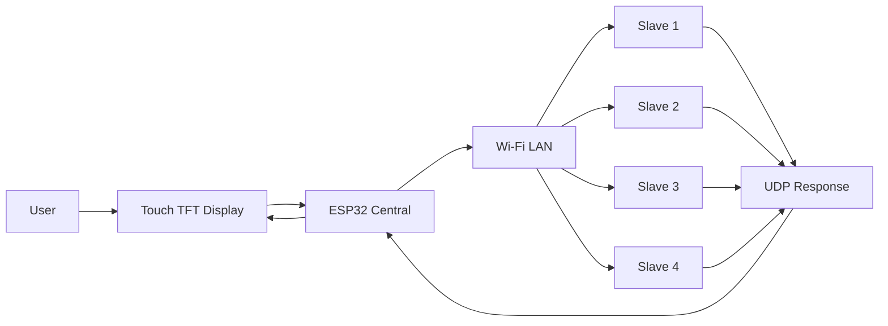

# ESP32 Central

<div align="center">

# ESP32 Central

**ESP32 touchscreen control hub for local and remote device orchestration**

[](https://github.com/paulocfmarques-collab/esp32_central)
[](https://github.com/paulocfmarques-collab/esp32_central)
[](https://github.com/paulocfmarques-collab/esp32_central)
[](https://github.com/paulocfmarques-collab/esp32_central)
[](https://github.com/paulocfmarques-collab/esp32_central)
[](https://github.com/paulocfmarques-collab/esp32_central)
[](https://github.com/paulocfmarques-collab/esp32_central)
[](https://github.com/paulocfmarques-collab/esp32_central/commits/main)

</div>

> A polished ESP32 central controller for touchscreen-based automation, diagnostics, and remote command routing over local network.

---

## Table of Contents

- [Overview](#overview)
- [Screenshots & Demo](#screenshots--demo)
- [Key Features](#key-features)
- [Repository Map](#repository-map)
- [Architecture](#architecture)
- [Hardware Recommended](#hardware-recommended)
- [Installation](#installation)
- [First Access](#first-access)
- [Commands](#commands)
- [Advanced Capabilities](#advanced-capabilities)
- [Troubleshooting](#troubleshooting)
- [Security](#security)
- [Changelog](#changelog)
- [Author](#author)
- [Contributing](#contributing)

---

## Overview

**ESP32 Central** is a touchscreen-based control and diagnostics hub for ESP32 devices. It combines a graphical UI, UDP communication, Wi-Fi configuration, persistent settings, NTP synchronization, and OTA support into a compact embedded solution designed for local automation scenarios.

This README is intentionally written in a product-style format to work well as a **portfolio project** or a **GitHub Marketplace-style showcase**.

---

## Screenshots & Demo

> Add your real screenshots or demo media here to make the project feel production-ready.

### Suggested media placeholders

| Preview | Description |
| --- | --- |
| `docs/screenshots/home.png` | Main dashboard / home screen |
| `docs/screenshots/remote-mode.png` | Remote command selection UI |
| `docs/screenshots/config-ap.png` | Wi-Fi configuration portal |
| `docs/demo/demo.gif` | Short interaction demo |

### Demo video

- **YouTube / Loom / Drive link:** `https://your-demo-link-here`
- **Live hardware walkthrough:** `https://your-live-demo-link-here`

If you want, I can also generate a `docs/` folder structure and ready-to-use image captions.

---

## Key Features

- Touchscreen UI for navigation, diagnostics, and command execution
- **LOCAL** mode for on-device control and diagnostics
- **REMOTE** mode for UDP command delivery to slave devices
- Support for up to **4 slave devices** on the local network
- Built-in Wi-Fi configuration portal at `192.168.4.1`
- Automatic **NTP** time synchronization
- Persistent network and system configuration in flash
- **OTA** firmware update support over the network
- Device diagnostics: CPU, RAM, flash, temperature, network, uptime
- Asynchronous status LED control with blink mode

---

## Repository Map

| File | Purpose |
| --- | --- |
| `Central.ino` | Firmware entry point, initialization, and main loop |
| `Botao.h` | UI button structure and representation |
| `CommandHandler.cpp` / `CommandHandler.h` | Local and remote command processing |
| `Display.cpp` / `Display.h` | TFT display rendering helpers |
| `ScreenRenderer.cpp` / `ScreenRenderer.h` | Screen composition and visual rendering |
| `TouchDriver.cpp` / `TouchDriver.h` | Touch input reading and handling |
| `InterfaceCentral.cpp` / `InterfaceCentral.h` | Main control interface organization |
| `LayoutDatabase.cpp` / `LayoutDatabase.h` | UI layout and page catalog |
| `UdpComm.cpp` / `UdpComm.h` | UDP communication with slave devices |
| `WifiConfig.cpp` / `WifiConfig.h` | Wi-Fi configuration and persistence |
| `NTPUtil.h` | NTP time synchronization helpers |
| `README.md` | Project documentation |
| `CHANGELOG.md` | Professional change history |

---

## Architecture


```mermaid
graph LR
    U[User] --> T[Touch TFT Display]
    T --> C[ESP32 Central]
    C --> W[Wi-Fi LAN]

    W --> S1[Slave 1]
    W --> S2[Slave 2]
    W --> S3[Slave 3]
    W --> S4[Slave 4]

    S1 --> R[UDP Response]
    S2 --> R
    S3 --> R
    S4 --> R

    R --> C
    C --> T
```

---

## Hardware Recommended

| Component | Specification |
| --- | --- |
| Processor | ESP32 with Wi-Fi |
| Display | 320×240 TFT SPI |
| Touch | XPT2046 |
| Status LED | GPIO 4 |
| Power | Stable 5V supply |
| Network | Local 2.4 GHz Wi-Fi |

---

## Installation

1. Clone the repository:

```bash
git clone https://github.com/paulocfmarques-collab/esp32_central.git
cd esp32_central
```

2. Install the required Arduino IDE libraries:

- `TFT_eSPI`
- `XPT2046_Touchscreen`

3. Configure the display inside the `TFT_eSPI` library setup files.

4. Select **ESP32 Dev Module** and upload the firmware.

---

## First Access

1. The ESP32 creates the access point `ESP32_CENTRAL_CONFIG`
2. Connect to the AP
3. Open `192.168.4.1`
4. Enter the SSID, password, and optionally the slave IPs
5. Save the configuration and wait for the reboot

---

## Commands

### Local commands

- `help`
- `info`
- `status`
- `reason`
- `version`
- `build`
- `cpu`
- `ram`
- `flash`
- `temp`
- `psram`
- `mac`
- `net_info`
- `time`
- `date`
- `led_on`
- `led_off`
- `led_blink:500`
- `set_escravo1:IP`
- `set_escravo2:IP`
- `set_escravo3:IP`
- `set_escravo4:IP`
- `set_fuso:-3`
- `scan`
- `reset_wifi`
- `desligar`
- `lastcmd`
- `cmdcount`
- `vago`

### Remote commands via UDP

- `LED_ON`
- `LED_OFF`
- `LED_BLINK:1000`
- `TEMP`
- `CPU`
- `RAM`
- `FLASH`
- `INFO`
- `STATUS`
- `VERSION`
- `UPTIME`
- `NET_INFO`
- `TIME`
- `DATE`
- `alive`

---

## Advanced Capabilities

### NTP
Automatic time synchronization with configurable timezone.

### OTA
Remote firmware update support over the network.

### Persistence
Network and state settings are stored for recovery after restart.

### Asynchronous LED
The status LED can blink without blocking the main loop.

---

## Troubleshooting

| Problem | Solution |
| --- | --- |
| Black screen | Check TFT wiring and pin mapping |
| Touch not working | Verify XPT2046 wiring and calibration |
| Wi-Fi won’t connect | Open `192.168.4.1` and validate SSID/password |
| No UDP response | Confirm all slaves are on the same network |
| NTP not syncing | Check internet access and DNS |
| OTA fails | Reboot the ESP32 and confirm available flash space |

---

## Security

This project is intended for trusted local networks.

- UDP is not encrypted
- The web portal has no default authentication
- Do not expose the device directly to the internet
- Do not store real credentials in public repositories

---

## Changelog

See [`CHANGELOG.md`](./CHANGELOG.md) for the full professional history of changes.

---

## Author

**Paulo Marques**  
GitHub: [@paulocfmarques-collab](https://github.com/paulocfmarques-collab)

---

## Contributing

Found a bug or have an idea? Open an issue or submit a pull request.

---

<div align="center">

**Built with ❤️ for the ESP32 community**


</div>
