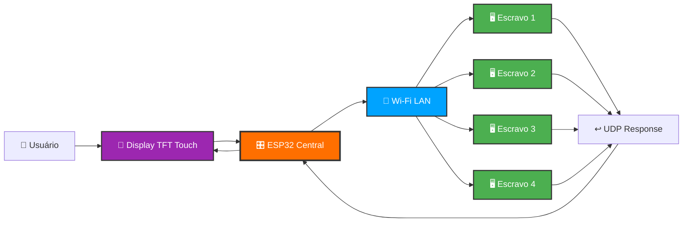

# ESP32 Central

<div align="center">


</div>

> **Uma central completa de automação, monitoramento e comando para ESP32 com interface touchscreen, operação local/remota e integração com múltiplos dispositivos escravos em rede local.**

---

## ✨ Funcionalidades principais

<table>
<tr>
<td width="50%">

### 🎛️ Controle duplo
- **Modo Local**: diagnósticos diretos no central
- **Modo Remoto**: controle de até 4 escravos via UDP
- Seleção visual de dispositivo alvo

</td>
<td width="50%">

### 📱 Interface touchscreen
- Display TFT 320×240 com XPT2046
- Navegação de 3 páginas por modo
- Respostas com scroll automático

</td>
</tr>
<tr>
<td width="50%">

### 🌐 Conectividade inteligente
- Portal web de configuração em `192.168.4.1`
- Sincronização NTP automática
- Salvamento persistente em flash

</td>
<td width="50%">

### 📡 Comunicação robusta
- UDP com timeout e retry
- Cache de IPs dos escravos
- Detecção automática online/offline

</td>
</tr>
<tr>
<td width="50%">

### ⚡ Atualizações OTA
- Firmware via rede sem USB
- Barra de progresso na tela
- Proteção de watchdog

</td>
<td width="50%">

### 🔧 Diagnostics avançados
- CPU temperature, RAM, flash
- Status de rede e NTP
- Histórico de resets

</td>
</tr>
</table>

---

## 🏗️ Arquitetura do sistema


```mermaid
graph LR
    A["👤 Usuário"] --> B["📱 Display TFT Touch"]
    B --> C["🎛️ ESP32 Central"]
    C --> D["📶 Wi-Fi LAN"]
    
    D --> E["🖥️ Escravo 1"]
    D --> F["🖥️ Escravo 2"]
    D --> G["🖥️ Escravo 3"]
    D --> H["🖥️ Escravo 4"]
    
    E --> I["↩️ UDP Response"]
    F --> I
    G --> I
    H --> I
    
    I --> C
    C --> B
    
    style C fill:#FF6F00,stroke:#333,stroke-width:3px,color:#fff
    style B fill:#9C27B0,stroke:#333,stroke-width:2px,color:#fff
    style E fill:#4CAF50,stroke:#333,stroke-width:2px,color:#fff
    style F fill:#4CAF50,stroke:#333,stroke-width:2px,color:#fff
    style G fill:#4CAF50,stroke:#333,stroke-width:2px,color:#fff
    style H fill:#4CAF50,stroke:#333,stroke-width:2px,color:#fff
    style D fill:#00A3FF,stroke:#333,stroke-width:2px,color:#fff
```

---

## 🛠️ Hardware recomendado

| Componente | Especificação |
| --- | --- |
| **Processador** | ESP32 (qualquer variante com Wi‑Fi) |
| **Display** | TFT 320×240 resolução, interface SPI |
| **Touch** | Controlador XPT2046 (resistivo) |
| **LED Status** | Pino GPIO 4 |
| **Alimentação** | 5V estável (USB ou adapter) |
| **Rede** | Wi‑Fi 2.4GHz local |

---

## 📋 Comandos implementados

### 🔹 Comandos locais (executados no central)

| Categoria | Comando | Sintaxe | Resultado |
| :--- | :--- | :--- | :--- |
| **Diagnostics** | `help` | `help` | Lista todos os comandos e sintaxe |
| **Diagnostics** | `info` | `info` | Status completo do dispositivo |
| **Diagnostics** | `status` | `status` | Resumo rápido (rede, heap, NTP) |
| **Diagnostics** | `reason` | `reason` | Motivo do último reset |
| **Diagnostics** | `version` | `version` | Versão do firmware |
| **Diagnostics** | `build` | `build` | Data e hora da compilação |
| **Hardware** | `cpu` | `cpu` | Modelo, núcleos e frequência |
| **Hardware** | `ram` | `ram` | Heap total e heap livre (KB) |
| **Hardware** | `flash` | `flash` | Tamanho e velocidade da memória |
| **Hardware** | `temp` | `temp` | Temperatura interna da CPU (°C) |
| **Hardware** | `uptime` | `uptime` | Tempo de atividade em segundos |
| **Rede** | `mac` | `mac` | Endereço MAC do Wi‑Fi |
| **Rede** | `net_info` | `net_info` | IP local, RSSI e SSID |
| **Rede** | `time` | `time` | Hora atual sincronizada via NTP |
| **Rede** | `date` | `date` | Data atual sincronizada via NTP |
| **LED** | `led_on` | `led_on` | Liga o LED de status (GPIO 4) |
| **LED** | `led_off` | `led_off` | Desliga o LED |
| **LED** | `led_blink` | `led_blink:500` | Pisca com intervalo em ms (ex: 500, 800, 1000) |
| **Config** | `set_escravo1` | `set_escravo1:192.168.0.10` | Configura IP do escravo 1 |
| **Config** | `set_escravo2` | `set_escravo2:192.168.0.11` | Configura IP do escravo 2 |
| **Config** | `set_escravo3` | `set_escravo3:192.168.0.12` | Configura IP do escravo 3 |
| **Config** | `set_escravo4` | `set_escravo4:192.168.0.13` | Configura IP do escravo 4 |
| **Config** | `set_fuso` | `set_fuso:-3` | Altera timezone NTP (GMT-3, GMT-5, etc) |
| **Config** | `scan` | `scan` | Varredura de escravos (online/offline) |
| **Config** | `reset_wifi` | `reset_wifi` | Limpa flash e abre portal de configuração |
| **Config** | `reset` | `reset` | Reinicia o ESP32 |
| **Config** | `desligar` | `desligar` | Deep sleep com display desligado |
| **Interno** | `lastcmd` | `lastcmd` | Mostra o último comando processado |
| **Interno** | `cmdcount` | `cmdcount` | Contagem total de comandos |
| **Interno** | `vago` | `vago` | Placeholder para comando não utilizado |

---

### 🔵 Comandos remotos (enviados via UDP aos escravos)

| Comando | Sintaxe | Resultado | Escravos |
| :--- | :--- | :--- | :--- |
| `LED_ON` | `LED_ON` | Liga LED no escravo | 1-4 |
| `LED_OFF` | `LED_OFF` | Desliga LED no escravo | 1-4 |
| `LED_BLINK` | `LED_BLINK:1000` | Pisca LED com intervalo em ms | 1-4 |
| `TEMP` | `TEMP` | Temperatura da CPU do escravo | 1-4 |
| `CPU` | `CPU` | Info de processador | 1-4 |
| `RAM` | `RAM` | Status de memória | 1-4 |
| `FLASH` | `FLASH` | Info de armazenamento | 1-4 |
| `INFO` | `INFO` | Status completo do escravo | 1-4 |
| `STATUS` | `STATUS` | Resumo rápido | 1-4 |
| `VERSION` | `VERSION` | Versão do firmware | 1-4 |
| `UPTIME` | `UPTIME` | Tempo de atividade | 1-4 |
| `NET_INFO` | `NET_INFO` | IP, RSSI, SSID do escravo | 1-4 |
| `TIME` | `TIME` | Hora atual sincronizada | 1-4 |
| `DATE` | `DATE` | Data atual sincronizada | 1-4 |
| `alive` | `alive` | Ping para detecção (usado em SCAN) | 1-4 |

> **Nota**: O modo REMOTE da interface permite selecionar o alvo (Escravo 1-4) antes de disparar o comando. Todos os comandos remotos são enviados via UDP na porta 4210.

---

## 🚀 Guia de instalação

### 1️⃣ Clone o repositório

```bash
git clone https://github.com/paulocfmarques-collab/esp32_central.git
cd esp32_central
```

### 2️⃣ Instale as bibliotecas

No **Arduino IDE** → **Sketch → Include Library → Manage Libraries**:

- `TFT_eSPI` (para display)
- `XPT2046_Touchscreen` (para touch)

*Bibliotecas padrão do ESP32 (WiFi, WebServer, Preferences) já vêm integradas.*

### 3️⃣ Configure o display

Edite `TFT_eSPI/User_Setup.h` com os pinos do seu módulo:

```cpp
#define TFT_MOSI 23
#define TFT_MISO 19
#define TFT_SCLK 18
#define TFT_CS   15
#define TFT_DC   2
```

### 4️⃣ Upload e boot

- Selecione **ESP32 Dev Module** como placa
- Escolha a porta serial
- Faça o upload
- Abra o monitor serial em **115200 baud**

---

## 🌐 Primeiro acesso

### Sem credenciais Wi‑Fi salvas?

1. O ESP32 abre um ponto de acesso: **`ESP32_CENTRAL_CONFIG`**
2. Conecte seu celular/PC (sem senha)
3. Abra o navegador em **`192.168.4.1`**
4. Preencha:
   - SSID e senha da sua rede Wi‑Fi
   - IPs dos 4 escravos (opcional)
5. Clique em **Save** → reinicia automaticamente

### Recuperar acesso?

Envie o comando via serial ou botão: `reset_wifi`

---

## 🎮 Modo de uso

### Local (self-diagnostics)
```
1. Selecione "LOCAL" na tela inicial
2. Navegue pelas 3 páginas de comandos
3. Toque no comando desejado
4. Leia a resposta (com scroll se necessário)
5. Toque em qualquer lugar para retornar ao menu
```

### Remoto (controle de escravos)
```
1. Selecione "REMOTE" na tela inicial
2. Escolha o alvo: "ESP 1", "ESP 2", "ESP 3" ou "ESP 4"
3. Navegue e toque no comando
4. Aguarde a resposta UDP
5. Toque para retornar
```

---

## 📡 Fluxo de comunicação

```
┌─────────────────────────────────────────────────────────┐
│                    Usuário toca botão                   │
└──────────────────────┬──────────────────────────────────┘
                       │
                       ▼
        ┌──────────────────────────────┐
        │   ESP32 Central detecta      │
        │   toque e modo (L/R)         │
        └──────────┬───────────────────┘
                   │
        ┌──────────┴──────────┐
        │                     │
        ▼                     ▼
   ┌────────┐         ┌─────────────┐
   │ LOCAL  │         │ REMOTE      │
   │Execute │         │ Send UDP    │
   │localmente        │ to Slave    │
   └────┬───┘         └──────┬──────┘
        │                    │
        ▼                    ▼
   ┌──────────────────────────────────┐
   │   Parseia resposta (texto)       │
   │   Renderiza na tela              │
   │   Auto-scroll se > 240px         │
   └──────────┬───────────────────────┘
              │
              ▼
   ┌──────────────────────────────────┐
   │   Auto-fecha em 7 segundos       │
   │   ou toque no display            │
   └──────────────────────────────────┘
```

---

## 🔧 Recursos avançados

### ⏰ Network Time Protocol (NTP)

Sincronização automática ao ligar. Timezone padrão: **GMT-3**

Altere com: `set_fuso:-5` (para GMT-5, por exemplo)

### 📦 OTA (Over-The-Air Updates)

1. Arduino IDE → **Sketch → Upload Using Network**
2. Selecione a porta do ESP32 em rede
3. O sistema exibe barra de progresso na tela
4. Reinicia automaticamente após conclusão

### 💾 Persistência

- SSID e senha → Preferences (flash)
- IPs dos escravos → Cache em RAM + Preferences
- Histórico de resets → Detectado via `esp_reset_reason()`

### 🔴 LED Assíncrono

O LED pisca **sem bloquear** o loop principal:
```cpp
led_blink:800  // Pisca a cada 800ms
led_on         // Fica ligado
led_off        // Desliga
```

---

## 🐛 Troubleshooting

| Problema | Solução |
| :--- | :--- |
| **Tela preta** | Verifique a pinagem do TFT no `User_Setup.h` |
| **Touch não funciona** | Teste XPT2046 pins; ajuste filtro de pressão |
| **Wi‑Fi não conecta** | Acesse portal em `192.168.4.1`; verifique SSID/senha |
| **UDP sem resposta** | Confira se escravos estão na mesma LAN; firewall? |
| **NTP não sincroniza** | Certifique-se de acesso à internet; DNS ativo |
| **OTA falla** | Reinicie o ESP; verifique espaço em flash |

---

## 🔒 Segurança

⚠️ **Este projeto é para redes locais confiáveis:**

- UDP **não é criptografado**
- Portal web **sem autenticação** por padrão
- Nunca exponha à internet aberta
- Não commite senhas reais em repositórios

---

## 📚 Estrutura de arquivos

```
esp32_central/
├── Central.ino                  # Entry point & main loop
├── Display.h/.cpp              # Abstração TFT
├── InterfaceCentral.h/.cpp     # Navegação e layout
├── UdpComm.h/.cpp             # Comunicação UDP
├── WifiConfig.h/.cpp          # Portal Wi-Fi
├── CommandHandler.h            # Parser de comandos
├── LayoutDatabase.h/.cpp       # Dados dos botões
├── NTPUtil.h                   # Time sync
├── TouchDriver.h/.cpp          # Touch input
├── ScreenRenderer.h/.cpp       # Renderização
├── Botao.h                     # Estrutura de botões
└── README.md
```

---

## 📄 Licença

MIT License — veja [`LICENSE`](./LICENSE) para detalhes completos.

---

## 👤 Autor

**Paulo Marques**  
GitHub: [@paulocfmarques-collab](https://github.com/paulocfmarques-collab)

---

## 🤝 Contribuição

Encontrou um bug? Tem uma ideia? Abra uma [issue](https://github.com/paulocfmarques-collab/esp32_central/issues) ou envie um [pull request](https://github.com/paulocfmarques-collab/esp32_central/pulls).

---

<div align="center">

**Feito com ❤️ para a comunidade ESP32**


</div>
