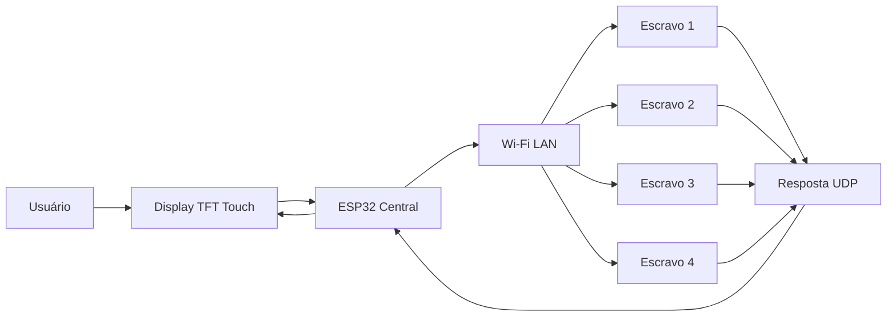

# ESP32 Central

<div align="center">


</div>

> Central de automação, monitoramento e comando para ESP32 com interface touchscreen, operação local/remota e comunicação com múltiplos dispositivos escravos em rede local.

---

## ✨ Visão geral

O **ESP32 Central** é um projeto para controle e diagnóstico de dispositivos ESP32, combinando interface gráfica touchscreen, comunicação UDP e configuração via web. Ele foi organizado para facilitar operação em modo local e remoto, com suporte a persistência de configurações e atualização OTA.

---

## 📁 Estrutura do repositório

| Arquivo | Função |
| --- | --- |
| `Central.ino` | Ponto de entrada do firmware, inicialização do sistema e loop principal |
| `CommandHandler.cpp` / `CommandHandler.h` | Processamento dos comandos locais e remotos |
| `Display.cpp` / `Display.h` | Rotinas de exibição na tela TFT |
| `ScreenRenderer.cpp` / `ScreenRenderer.h` | Renderização das telas e componentes visuais |
| `TouchDriver.cpp` / `TouchDriver.h` | Leitura e tratamento do touch |
| `Botao.h` | Estrutura/representação de botões da interface |
| `InterfaceCentral.cpp` / `InterfaceCentral.h` | Organização da interface principal da central |
| `LayoutDatabase.cpp` / `LayoutDatabase.h` | Catálogo/estrutura dos layouts e páginas da UI |
| `UdpComm.cpp` / `UdpComm.h` | Comunicação UDP com os escravos |
| `WifiConfig.cpp` / `WifiConfig.h` | Configuração e persistência de rede Wi‑Fi |
| `NTPUtil.h` | Utilitários para sincronização de horário via NTP |
| `README.md` | Documentação principal do projeto |
| `CHANGELOG.md` | Histórico profissional de alterações |

---

## 🚀 Principais recursos

- Interface touchscreen para navegação por telas e comandos
- Modo **LOCAL** para diagnóstico direto da central
- Modo **REMOTE** para envio de comandos via UDP aos escravos
- Suporte a até **4 escravos** na rede local
- Portal de configuração Wi‑Fi em `192.168.4.1`
- Sincronização automática de hora via **NTP**
- Persistência de credenciais e configurações em flash
- Atualização **OTA** pela rede
- Diagnósticos de CPU, RAM, flash, temperatura, rede e uptime
- LED de status com comandos independentes e modo blink assíncrono

---

## 🧩 Arquitetura do sistema


```mermaid
graph LR
    A[Usuário] --> B[Display TFT Touch]
    B --> C[ESP32 Central]
    C --> D[Wi‑Fi LAN]

    D --> E[Escravo 1]
    D --> F[Escravo 2]
    D --> G[Escravo 3]
    D --> H[Escravo 4]

    E --> I[Resposta UDP]
    F --> I
    G --> I
    H --> I

    I --> C
    C --> B
```

---

## 🛠️ Hardware recomendado

| Componente | Especificação |
| --- | --- |
| Processador | ESP32 com Wi‑Fi |
| Display | TFT 320×240 SPI |
| Touch | XPT2046 |
| LED de status | GPIO 4 |
| Alimentação | 5V estável |
| Rede | Wi‑Fi 2.4 GHz local |

---

## 📋 Comandos implementados

### Comandos locais

- `help`
- `info`
- `status`
- `reason`
- `version`
- `build`
- `cpu`
- `ram`
- `flash`
- `temp`
- `psram`
- `mac`
- `net_info`
- `time`
- `date`
- `led_on`
- `led_off`
- `led_blink:500`
- `set_escravo1:IP`
- `set_escravo2:IP`
- `set_escravo3:IP`
- `set_escravo4:IP`
- `set_fuso:-3`
- `scan`
- `reset_wifi`
- `desligar`
- `lastcmd`
- `cmdcount`
- `vago`

### Comandos remotos via UDP

- `LED_ON`
- `LED_OFF`
- `LED_BLINK:1000`
- `TEMP`
- `CPU`
- `RAM`
- `FLASH`
- `INFO`
- `STATUS`
- `VERSION`
- `UPTIME`
- `NET_INFO`
- `TIME`
- `DATE`
- `alive`

---

## 📦 Instalação

1. Clone o repositório:

```bash
git clone https://github.com/paulocfmarques-collab/esp32_central.git
cd esp32_central
```

2. Instale as bibliotecas necessárias no Arduino IDE:

- `TFT_eSPI`
- `XPT2046_Touchscreen`

3. Configure o display no arquivo de setup da biblioteca `TFT_eSPI`.

4. Selecione a placa **ESP32 Dev Module** e faça o upload.

---

## 🌐 Primeiro acesso

1. O ESP32 cria o ponto de acesso `ESP32_CENTRAL_CONFIG`
2. Conecte-se ao AP
3. Acesse `192.168.4.1`
4. Informe o SSID, a senha e, opcionalmente, os IPs dos escravos
5. Salve as configurações e aguarde a reinicialização

---

## 📡 Fluxo de comunicação

1. O usuário interage com a tela
2. A central identifica o modo e o comando
3. Em modo LOCAL, o comando é executado na própria central
4. Em modo REMOTE, o comando é enviado por UDP ao escravo selecionado
5. A resposta é exibida na tela

---

## 🔧 Recursos avançados

### NTP

Sincronização automática de horário com timezone ajustável.

### OTA

Suporte a atualização remota do firmware pela rede.

### Persistência

As configurações de rede e estado são armazenadas para recuperação após reinicialização.

### LED assíncrono

O LED pode piscar sem bloquear o loop principal do firmware.

---

## 🧪 Troubleshooting

| Problema | Solução |
| --- | --- |
| Tela preta | Verifique a pinagem do TFT |
| Touch não funciona | Confira os pinos do XPT2046 e a calibração |
| Wi‑Fi não conecta | Acesse `192.168.4.1` e valide SSID/senha |
| UDP sem resposta | Confirme que os escravos estão na mesma rede |
| NTP não sincroniza | Verifique internet e DNS |
| OTA falha | Reinicie o ESP32 e confirme o espaço em flash |

---

## 🔒 Segurança

Este projeto foi desenvolvido para redes locais confiáveis.

- UDP não é criptografado
- O portal web não possui autenticação por padrão
- Não exponha o dispositivo diretamente à internet
- Não armazene credenciais reais em repositórios públicos

---

## 📚 Changelog

Consulte o arquivo [`CHANGELOG.md`](./CHANGELOG.md) para o histórico completo e profissional de alterações.

---

## 👤 Autor

**Paulo Marques**  
GitHub: [@paulocfmarques-collab](https://github.com/paulocfmarques-collab)

---

## 🤝 Contribuição

Encontrou um bug ou tem uma ideia? Abra uma issue ou envie um pull request.

---

<div align="center">

**Feito com ❤️ para a comunidade ESP32**


</div>
