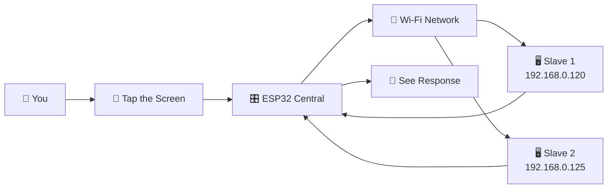

# ESP32 Central

<div align="center">


</div>

> **A full-featured touchscreen control hub for ESP32 automation projects.** Monitor and command multiple remote nodes, execute local diagnostics, manage Wi‑Fi on the fly, and sync your system clock—all from one compact device with a beautiful 3.2" display.

---

## ✨ What You Get

- **Dual-mode interface**: Switch between local commands (self-diagnostics) and remote control (send UDP commands to slave devices)
- **Dual-target support**: Seamlessly toggle between two ESP32 slaves on your network
- **Live response display**: See results instantly on the touchscreen with auto-scrolling output
- **Web configuration portal**: First-time setup or credential reset through a simple web form at `192.168.4.1`
- **Real-time clock**: Built-in NTP sync to keep your ESP32 timestamp-perfect
- **OTA updates**: Deploy new firmware wirelessly without plugging in a USB cable
- **Persistent settings**: Automatic save of Wi‑Fi credentials and device IPs to flash memory
- **Rich command set**: Temperature, memory, network info, uptime, LED control, and more

---

## 🏗️ How It Works


```mermaid
flowchart LR
    User["👤 You"] --> Touch["📱 Tap the Screen"]
    Touch --> Central["🎛️ ESP32 Central"]
    Central --> WiFi["📶 Wi‑Fi Network"]
    WiFi --> Node1["🖥️ Slave 1<br/>192.168.0.120"]
    WiFi --> Node2["🖥️ Slave 2<br/>192.168.0.125"]
    Node1 --> Central
    Node2 --> Central
    Central --> Display["💬 See Response"]
```

### The Flow

1. **You tap a button** on the 320×240 TFT touchscreen
2. **The central decides**: run the command locally or send it over UDP?
3. **Command goes out**: UDP packet lands on the target ESP32
4. **Response comes back**: Text answer is parsed and displayed
5. **Auto-reset**: After 7 seconds or another tap, return to the menu

---

## 📦 What's Inside

```
Central.ino                  ← Entry point & main loop
├── Display/                  → Screen rendering & initialization
├── InterfaceCentral/         → Touch detection & button layout
├── WifiConfig/               → Network & portal setup
├── UdpComm/                  → Send/receive UDP packets
├── CommandHandler/           → Execute commands & OTA
├── NTPUtil/                  → Time synchronization
└── Botao/                    → UI constants & button definitions
```

---

## 🛠️ Hardware Setup

### You'll Need

| Component | Notes |
| --- | --- |
| **ESP32 Dev Board** | Any variant—32 works great |
| **2.8" TFT Display (SPI)** | 320×240 resolution |
| **XPT2046 Touch Controller** | Resistive touch panel |
| **LED** | On GPIO 4 for status feedback |
| **Power Supply** | USB or 5V adapter |
| **Wi‑Fi Router** | Local network only |

### Wiring (5 minutes)

```
┌─────────────────────────────┐
│         ESP32               │
│                             │
│  GPIO 25 ────→ Touch CLK    │
│  GPIO 39 ────→ Touch MISO   │
│  GPIO 32 ────→ Touch MOSI   │
│  GPIO 33 ────→ Touch CS     │
│  GPIO 4  ────→ Status LED   │
│  GPIO 21 ────→ Aux Output   │
└─────────────────────────────┘
        │
    Wi‑Fi Network
        │
    ┌───┴───────────────────┐
    │                       │
  Slave 1          Slave 2
192.168.0.120    192.168.0.125
```

> **Tip**: Double-check your display's pinout before soldering. The touch pins are fixed, but the TFT data pins may vary by module.

---

## 🚀 Getting Started

### 1. Grab the Code
```bash
git clone https://github.com/paulocfmarques-collab/esp32_central.git
cd esp32_central
```

### 2. Install Dependencies in Arduino IDE
- Go to **Sketch → Include Library → Manage Libraries**
- Search and install:
  - `TFT_eSPI`
  - `XPT2046_Touchscreen`

### 3. Configure Your Display
Edit `TFT_eSPI/User_Setup.h` to match your screen pinout. Example:
```cpp
#define TFT_MOSI 23
#define TFT_MISO 19
#define TFT_SCLK 18
#define TFT_CS   15
#define TFT_DC   2
```

### 4. Upload & Enjoy
- Select **ESP32 Dev Module** from the board menu
- Hit **Upload**
- Open the serial monitor (115200 baud) to watch it boot

---

## 💬 Command Palette

### Local Commands (Run on Central)

Perfect for monitoring your central's health—CPU temp, free memory, network signal strength, firmware version, uptime, and more.

| Command | Result |
| --- | --- |
| `INFO` | Full device summary |
| `TEMP` | CPU temperature |
| `CPU` | Processor specs |
| `RAM` | Memory snapshot |
| `FLASH` | Storage info |
| `UPTIME` | How long it's been running |
| `MAC` | Network address |
| `NET_INFO` | IP, RSSI, SSID |
| `LED_ON` / `LED_OFF` | Toggle local LED |
| `LED_BLINK:500` | Pulse at interval (ms) |
| `STATUS` | System health check |
| `TIME` / `DATE` | Clock info |
| `VERSION` / `BUILD` | Firmware details |

### Remote Commands (Send to Slaves)

Trigger these on any remote node from your touchscreen. Same command set, dispatched over UDP.

- `LED_ON`, `LED_OFF`, `LED_BLINK:1000`
- `TEMP`, `CPU`, `RAM`
- `INFO`, `STATUS`, `VERSION`
- `UPTIME`, `NET_INFO`
- ...and more

---

## 🌐 First-Time Setup

**No saved Wi‑Fi yet?** The ESP32 will boot into **configuration mode**.

1. Look for the access point `ESP32_CENTRAL_CONFIG` on your phone/laptop
2. Connect to it (no password needed)
3. Open a browser to `192.168.4.1`
4. Fill in your network SSID, password, and the IPs of your two slave devices
5. **Save** → ESP32 reboots and connects automatically

After that, credentials are saved to flash. Change them anytime by sending a `RESET_WIFI` command.

---

## 🎮 Using the Interface

### Mode Selection
- **LOCAL**: Run diagnostics and tests on the central itself
- **REMOTE**: Pick a slave device and fire commands at it

### Navigation
- **Page buttons**: Flip through 3 pages of commands per mode
- **Slave selector** (remote mode): Tap `ESP 1` or `ESP 2` to switch targets
- **Touch anywhere on response**: Return to the main menu instantly

### Response Screen
- Answers scroll naturally if they're long
- Auto-returns to menu after 7 seconds
- All output is green text on black for readability

---

## 🔧 Advanced Features

### Network Time Protocol (NTP)
The central syncs with public NTP servers on boot. Timezone is set to GMT-3 by default but adjustable:
```
SET_FUSO:-5    ← Change to Eastern Time
```

### OTA Updates
Deploy new firmware over Wi‑Fi without touching a USB cable. The system announces OTA progress on screen.

### Persistent Configuration
- Wi‑Fi SSID & password saved to flash
- Both slave device IPs stored automatically
- Can be reset at any time via the `RESET_WIFI` command

### Async LED Blink
LED blink runs independently in the main loop without blocking other operations.

---

## 🐛 Stuck? Try These

| Problem | Solution |
| --- | --- |
| Screen is black | Check TFT wiring & `User_Setup.h` config |
| Touch not working | Verify XPT2046 pin assignments; test pressure filtering |
| Wi‑Fi won't connect | Use fallback portal `ESP32_CENTRAL_CONFIG`; verify SSID/password |
| UDP commands fail | Confirm both devices on same LAN; check firewall rules |
| NTP not syncing | Ensure internet access before attempting sync |

**Still stuck?** Open an [issue](https://github.com/paulocfmarques-collab/esp32_central/issues)—we're here to help.

---

## 🔒 A Word on Security

This project is designed for **trusted local networks only**:
- UDP communication is unencrypted and unauthenticated
- The configuration portal has no password protection
- Never expose the device to the internet or untrusted networks
- Don't commit real Wi‑Fi passwords to version control

Use it in a home lab, maker space, or office LAN where you control who's on the network.

---

## 📄 License

MIT License — see [`LICENSE`](./LICENSE) for full details.

---

## 👤 Credits

**Paulo Marques**  
[GitHub @paulocfmarques-collab](https://github.com/paulocfmarques-collab)

---

## 🤝 Contributing

Found a bug? Have an idea? [Open an issue](https://github.com/paulocfmarques-collab/esp32_central/issues) or submit a pull request. Community feedback makes this project better.

---

<div align="center">

**Made with ❤️ for the ESP32 community**

</div>
