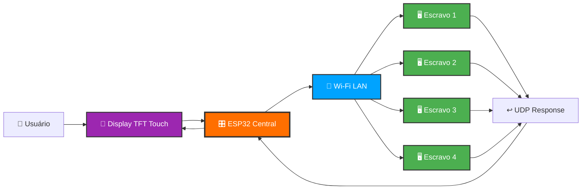
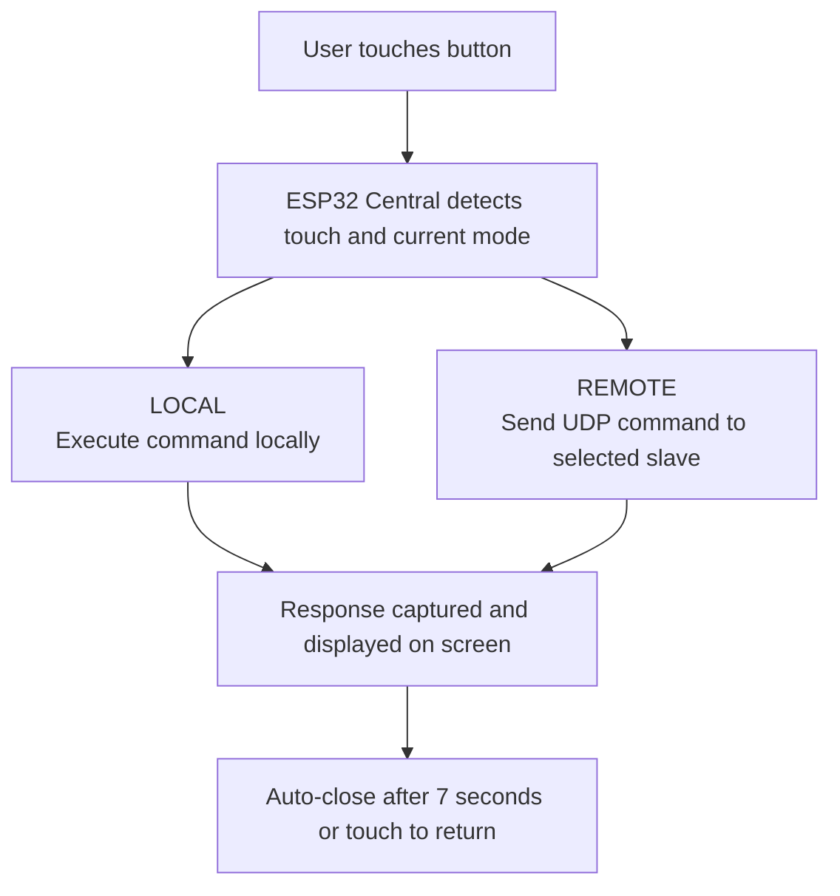

# ESP32 Central

<div align="center">


</div>

> Central completa de automação, monitoramento e comando para ESP32 com interface touchscreen, operação local/remota e integração com múltiplos dispositivos escravos em rede local.

---

## ✨ Funcionalidades principais

<table>
<tr>
<td width="50%">

### 🎛️ Controle duplo
- Modo Local: diagnósticos diretos na central
- Modo Remoto: envio de comandos UDP para até 4 escravos
- Seleção visual do alvo pela interface

</td>
<td width="50%">

### 📱 Interface touchscreen
- Display TFT 320×240 com XPT2046
- Navegação em telas por modo
- Respostas com rolagem automática

</td>
</tr>
<tr>
<td width="50%">

### 🌐 Conectividade inteligente
- Portal web de configuração em `192.168.4.1`
- Sincronização NTP automática
- Persistência de Wi‑Fi e IPs em flash

</td>
<td width="50%">

### 📡 Comunicação robusta
- UDP com timeout e retries
- Cache de IPs dos escravos
- Detecção automática online/offline

</td>
</tr>
<tr>
<td width="50%">

### ⚡ Atualizações OTA
- Firmware via rede sem USB
- Progresso exibido na tela
- Gestão do watchdog

</td>
<td width="50%">

### 🔧 Diagnósticos avançados
- Temperatura da CPU, RAM e flash
- Estado da rede e NTP
- Histórico de resets e uptime

</td>
</tr>
</table>

---

## 🏗️ Arquitetura do sistema


```mermaid
graph LR
    A["👤 Usuário"] --> B["📱 Display TFT Touch"]
    B --> C["🎛️ ESP32 Central"]
    C --> D["📶 Wi‑Fi LAN"]

    D --> E["🖥️ Escravo 1"]
    D --> F["🖥️ Escravo 2"]
    D --> G["🖥️ Escravo 3"]
    D --> H["🖥️ Escravo 4"]

    E --> I["↩️ UDP Response"]
    F --> I
    G --> I
    H --> I

    I --> C
    C --> B

    style C fill:#FF6F00,stroke:#333,stroke-width:3px,color:#fff
    style B fill:#9C27B0,stroke:#333,stroke-width:2px,color:#fff
    style E fill:#4CAF50,stroke:#333,stroke-width:2px,color:#fff
    style F fill:#4CAF50,stroke:#333,stroke-width:2px,color:#fff
    style G fill:#4CAF50,stroke:#333,stroke-width:2px,color:#fff
    style H fill:#4CAF50,stroke:#333,stroke-width:2px,color:#fff
    style D fill:#00A3FF,stroke:#333,stroke-width:2px,color:#fff
```

---

## 🛠️ Hardware recomendado

| Componente | Especificação |
| --- | --- |
| **Processador** | ESP32 (qualquer variante com Wi‑Fi) |
| **Display** | TFT 320×240 SPI |
| **Touch** | Controlador XPT2046 |
| **LED Status** | GPIO 4 |
| **Alimentação** | 5V estável |
| **Rede** | Wi‑Fi 2.4GHz local |

---

## 📋 Comandos implementados

### 🔹 Comandos locais (executados na central)

| Categoria | Comando | Sintaxe | Resultado |
| :--- | :--- | :--- | :--- |
| Diagnostics | `help` | `help` | Lista comandos aceitos |
| Diagnostics | `info` | `info` | Informações completas do dispositivo |
| Diagnostics | `status` | `status` | Resumo do sistema |
| Diagnostics | `reason` | `reason` | Motivo do último reset |
| Diagnostics | `version` | `version` | Versão do firmware |
| Diagnostics | `build` | `build` | Data/hora de compilação |
| Hardware | `cpu` | `cpu` | Modelo, revision e núcleos |
| Hardware | `ram` | `ram` | Heap total, livre e uso |
| Hardware | `flash` | `flash` | Tamanho e uso da flash |
| Hardware | `temp` | `temp` | Temperatura da CPU |
| Hardware | `psram` | `psram` | Estado e uso de PSRAM (se disponível) |
| Rede | `mac` | `mac` | Endereço MAC |
| Rede | `net_info` | `net_info` | IP, gateway, subnet, RSSI |
| Rede | `time` | `time` | Hora atual sincronizada |
| Rede | `date` | `date` | Data atual sincronizada |
| LED | `led_on` | `led_on` | Liga LED de status |
| LED | `led_off` | `led_off` | Desliga LED |
| LED | `led_blink` | `led_blink:500` | Pisca com intervalo em ms |
| Config | `set_escravo1` | `set_escravo1:192.168.0.10` | Define IP do escravo 1 |
| Config | `set_escravo2` | `set_escravo2:192.168.0.11` | Define IP do escravo 2 |
| Config | `set_escravo3` | `set_escravo3:192.168.0.12` | Define IP do escravo 3 |
| Config | `set_escravo4` | `set_escravo4:192.168.0.13` | Define IP do escravo 4 |
| Config | `set_fuso` | `set_fuso:-3` | Ajusta timezone NTP |
| Config | `scan` | `scan` | Varredura de escravos via UDP |
| Config | `reset_wifi` | `reset_wifi` | Limpa flash e reinicia em modo AP |
| Config | `desligar` | `desligar` | Entra em deep sleep |
| Interno | `lastcmd` | `lastcmd` | Mostra o último comando processado |
| Interno | `cmdcount` | `cmdcount` | Total de comandos processados |
| Interno | `vago` | `vago` | Placeholder livre |

> Observação: a implementação atual não inclui um comando literal `reset`; na prática, o sistema usa `reset_wifi` e `desligar` para as ações de reset/energia.

### 🔵 Comandos remotos (enviados via UDP aos escravos)

| Comando | Sintaxe | Resultado | Escravos |
| :--- | :--- | :--- | :--- |
| `LED_ON` | `LED_ON` | Liga LED no escravo | 1-4 |
| `LED_OFF` | `LED_OFF` | Desliga LED no escravo | 1-4 |
| `LED_BLINK` | `LED_BLINK:1000` | Pisca LED com intervalo em ms | 1-4 |
| `TEMP` | `TEMP` | Temperatura da CPU do escravo | 1-4 |
| `CPU` | `CPU` | Informações do processador | 1-4 |
| `RAM` | `RAM` | Status de memória | 1-4 |
| `FLASH` | `FLASH` | Informações de armazenamento | 1-4 |
| `INFO` | `INFO` | Status completo do escravo | 1-4 |
| `STATUS` | `STATUS` | Resumo rápido | 1-4 |
| `VERSION` | `VERSION` | Versão do firmware | 1-4 |
| `UPTIME` | `UPTIME` | Tempo de atividade | 1-4 |
| `NET_INFO` | `NET_INFO` | IP, RSSI e SSID do escravo | 1-4 |
| `TIME` | `TIME` | Hora atual sincronizada | 1-4 |
| `DATE` | `DATE` | Data atual sincronizada | 1-4 |
| `alive` | `alive` | Ping para detecção de presença | 1-4 |

> Todos os comandos remotos são enviados pela porta UDP `4210` e requerem alvo definido no modo REMOTE da interface.

---

## 🚀 Guia de instalação

### 1️⃣ Clone o repositório

```bash
git clone https://github.com/paulocfmarques-collab/esp32_central.git
cd esp32_central
```

### 2️⃣ Instale as bibliotecas

No Arduino IDE → Sketch → Include Library → Manage Libraries:

- `TFT_eSPI` (display)
- `XPT2046_Touchscreen` (touch)

Bibliotecas padrão do ESP32 como `WiFi`, `WebServer`, `Preferences` e `ArduinoOTA` já vêm integradas.

### 3️⃣ Configure o display

Edite `TFT_eSPI/User_Setup.h` com a pinagem do módulo:

```cpp
#define TFT_MOSI 23
#define TFT_MISO 19
#define TFT_SCLK 18
#define TFT_CS   15
#define TFT_DC   2
```

### 4️⃣ Upload e boot

- Selecione **ESP32 Dev Module** como placa
- Escolha a porta serial
- Faça o upload
- Abra o monitor serial em **115200 baud**

---

## 🌐 Primeiro acesso

### Sem credenciais Wi‑Fi salvas?

1. O ESP32 abre um ponto de acesso: `ESP32_CENTRAL_CONFIG`
2. Conecte seu celular/PC (sem senha)
3. Abra o navegador em `192.168.4.1`
4. Informe:
   - SSID e senha da rede Wi‑Fi
   - IPs dos 4 escravos (opcional)
5. Clique em **Save** e o sistema reinicia automaticamente

### Recuperar acesso?

Use o comando serial ou o terminal do firmware: `reset_wifi`

---

## 🎮 Modo de uso

### Local (self-diagnostics)

1. Selecione **LOCAL** na tela inicial
2. Navegue pelas páginas de comandos
3. Toque no comando desejado
4. Leia a resposta no painel
5. Toque em qualquer área para voltar ao menu

### Remoto (controle de escravos)

1. Selecione **REMOTE** na tela inicial
2. Escolha o alvo: **ESP 1**, **ESP 2**, **ESP 3** ou **ESP 4**
3. Navegue e toque no comando
4. Aguarde a resposta UDP
5. Toque para retornar

---

## 📡 Fluxo de comunicação


```mermaid
flowchart TD
    A[User touches button]
    B[ESP32 Central detects touch and current mode]
    C[LOCAL<br/>Execute command locally]
    D[REMOTE<br/>Send UDP command to selected slave]
    E[Response captured and displayed on screen]
    F[Auto-close after 7 seconds or touch to return]

    A --> B
    B --> C
    B --> D
    C --> E
    D --> E
    E --> F
```

---

## 🔧 Recursos avançados

### ⏰ NTP

Sincronização automática ao ligar. Timezone padrão: `GMT-3`

Exemplo:

```text
set_fuso:-5
```

### 📦 OTA (Over-The-Air)

1. Arduino IDE → Sketch → Upload Using Network
2. Selecione a porta do ESP32 em rede
3. O sistema exibe a barra de progresso
4. Reinicia automaticamente ao fim

### 💾 Persistência

- SSID e senha → `Preferences` em flash
- IPs dos escravos → cache em RAM + persistência
- Histórico de resets → obtido via `esp_reset_reason()`

### 🔴 LED assíncrono

O LED pode piscar sem bloquear o loop principal:

```text
led_blink:800
led_on
led_off
```

---

## 🐛 Troubleshooting

| Problema | Solução |
| :--- | :--- |
| **Tela preta** | Verifique a pinagem do TFT em `User_Setup.h` |
| **Touch não funciona** | Teste pinos do XPT2046 e ajuste filtro de pressão |
| **Wi‑Fi não conecta** | Acesse `192.168.4.1` e confirme SSID/senha |
| **UDP sem resposta** | Confirme que os escravos estão na mesma LAN |
| **NTP não sincroniza** | Verifique acesso à internet e DNS |
| **OTA falha** | Reinicie o ESP e confirme espaço em flash |

---

## 🔒 Segurança

⚠️ Este projeto foi desenvolvido para redes locais confiáveis:

- UDP não é criptografado
- Portal web não possui autenticação por padrão
- Não exponha a internet aberta
- Não comite credenciais reais em repositórios públicos

---

## 📚 Estrutura de arquivos


```mermaid
graph TD
    A[ESP32 Central Project]

    A --> B[Core]
    B --> B1[Central.ino]
    B --> B2[CommandHandler.cpp]
    B --> B3[CommandHandler.h]

    A --> C[Display]
    C --> C1[Display.cpp]
    C --> C2[Display.h]
    C --> C3[ScreenRenderer.cpp]
    C --> C4[ScreenRenderer.h]

    A --> D[Touch Interface]
    D --> D1[TouchDriver.cpp]
    D --> D2[TouchDriver.h]
    D --> D3[Botao.h]

    A --> E[Communication]
    E --> E1[UdpComm.cpp]
    E --> E2[UdpComm.h]
    E --> E3[WifiConfig.cpp]
    E --> E4[WifiConfig.h]
    E --> E5[NTPUtil.h]

    A --> F[User Interface]
    F --> F1[InterfaceCentral.cpp]
    F --> F2[InterfaceCentral.h]
    F --> F3[LayoutDatabase.cpp]
    F --> F4[LayoutDatabase.h]

    A --> G[Documentation]
    G --> G1[README.md]
    G --> G2[LICENSE]
```

> A lista acima reflete os arquivos atualmente presentes no repositório. O módulo `TFT_eSPI/User_Setup.h` é de configuração local da biblioteca externa e não é versionado aqui.

---

## 👤 Autor

**Paulo Marques**  
GitHub: [@paulocfmarques-collab](https://github.com/paulocfmarques-collab)

---

## 🤝 Contribuição

Encontrou um bug ou tem uma ideia? Abra uma [issue](https://github.com/paulocfmarques-collab/esp32_central/issues) ou envie um [pull request](https://github.com/paulocfmarques-collab/esp32_central/pulls).

---

<div align="center">

**Feito com ❤️ para a comunidade ESP32**


</div>
