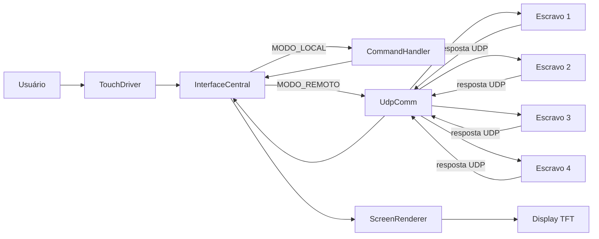

<div align="center">

# 📡 ESP32 Central

**Central de comando com interface TFT touch, operação local/remota e comunicação UDP com até 4 escravos ESP32.**


[Visão geral](#-visão-geral) •
[Preview](#-preview) •
[Como funciona](#-como-funciona) •
[Módulos](#-estrutura-do-repositório) •
[Comandos](#-comandos) •
[Instalação](#-instalação) •
[Roadmap](#-roadmap)

</div>

---

## ✨ Visão geral

O **ESP32 Central** é o firmware de uma central baseada em ESP32 com display TFT touch (320×240). A partir da tela é possível:

- executar comandos de diagnóstico na própria central (**modo local**);
- enviar comandos por **UDP** (porta `4210`) a até **4 escravos** na rede (**modo remoto**);
- configurar Wi‑Fi e IPs dos escravos por um **portal web**;
- atualizar o firmware pela rede via **ArduinoOTA**.

---

## 🖼️ Preview

<div align="center">

```text
┌──────────────────────────────────────────────┐
│                                              │
│        📷  Espaço reservado para preview     │
│                                              │
│   Adicione aqui uma foto ou captura da tela  │
│   da central (ex.: docs/preview.png) e       │
│   referencie-a com a sintaxe Markdown de     │
│   imagem.                                    │
│                                              │
└──────────────────────────────────────────────┘
```

</div>

> Ainda não há imagem de preview no repositório.

---

## 🧠 Como funciona

Fluxo de inicialização (`setup()` em `Central.ino`):

1. `displayHardware.inicializar()` e `central.inicializar()` (display e interface);
2. `CommandHandler::inicializarHardware()` (LED de status no GPIO 4);
3. criação da fila FreeRTOS `filaMensagens`;
4. `portalWifi.conectar()`:
   - **conectou** → `udp.inicializar()`, `OtaManager::inicializar(central)`, sincronização NTP (`ntp.initNTP(-3, false)`) e criação da tarefa `TaskCore0` (core 0), que escuta respostas UDP;
   - **falhou** → `portalWifi.iniciarPortal()` (portal de configuração).

O `loop()` (core 1) trata OTA, reconexão Wi‑Fi, relógio/indicador de Wi‑Fi, auto‑fechamento da tela de resposta, leitura do toque (`central.escanearToque()`), despacho do comando e timeout UDP.

### Modos de operação (`InterfaceCentral::Modo`)

| Modo | Valor | Comportamento |
| --- | --- | --- |
| `MODO_INICIAL` | 0 | Tela inicial: escolhe LOCAL ou um dos escravos 1–4 |
| `MODO_LOCAL` | 1 | Comando executado na própria central via `CommandHandler::executar` |
| `MODO_REMOTO` | 2 | Comando enviado por `udp.enviarComando` ao escravo ativo; timeout de 2,5 s |

O modo local/remoto possui 5 páginas de botões. A tela entra em proteção após 5 minutos sem toque.


```mermaid
graph LR
    U[Usuário] --> T[TouchDriver]
    T --> I[InterfaceCentral]
    I -->|MODO_LOCAL| C[CommandHandler]
    I -->|MODO_REMOTO| P[UdpComm]
    P --> E1[Escravo 1]
    P --> E2[Escravo 2]
    P --> E3[Escravo 3]
    P --> E4[Escravo 4]
    E1 & E2 & E3 & E4 -->|resposta UDP| P
    C --> I
    P --> I
    I --> R[ScreenRenderer] --> D[Display TFT]
```

---

## 📁 Estrutura do repositório

| Arquivo | Responsabilidade |
| --- | --- |
| `Central.ino` | Ponto de entrada: `setup()`, `loop()`, `codigoCore0` (tarefa UDP), fila FreeRTOS, OTA e watchdog |
| `CommandHandler.h` / `.cpp` | `CommandHandler::executar` (comandos locais/remotos, LED com blink assíncrono, versão/reset reason) e `OtaManager` (`ArduinoOTA`, hostname `ESP32_CENTRAL`) |
| `Display.h` / `.cpp` | Classe `Display`: encapsula o `TFT_eSPI` (`inicializar`, `getTftDriver`, `mostrarMensagemCentral`) |
| `ScreenRenderer.h` / `.cpp` | Classe `ScreenRenderer`: desenha cabeçalho, painel de páginas, menu de IPs, tela de resposta com scroll, relógio, sinal Wi‑Fi e rodapé |
| `InterfaceCentral.h` / `.cpp` | Classe `InterfaceCentral`: máquina de estados da UI (modos, páginas, escravo alvo, proteção de tela, auto‑fechamento) |
| `LayoutDatabase.h` / `.cpp` | `LayoutDatabase`: tabela `botoesAcao` (`struct Botao`, até 60 botões), geometria da tela inicial e `statusEscravos` |
| `TouchDriver.h` / `.cpp` | Classe `TouchDriver` (`XPT2046_Touchscreen`): `verificarToqueLegitimo` |
| `UdpComm.h` / `.cpp` | Classe `UdpComm`: envio/recepção UDP, timeout, IPs dos 4 escravos em `Preferences` |
| `WifiConfig.h` / `.cpp` | Classe `WifiConfig`: conexão Wi‑Fi e portal web (`WebServer`) com salvamento em `Preferences` |
| `NTPUtil.h` | Classe `NTPUtil`: `initNTP` com fuso configurável (`a.st1.ntp.br`, `pool.ntp.org`, `time.nist.gov`) |
| `Botao.h` | Constantes `SCREEN_W`/`SCREEN_H` e pinos do touch XPT2046 |
| `CHANGELOG.md` | Histórico de alterações |

---

## 🌐 Portal de configuração

Se a conexão Wi‑Fi falhar, a central abre o ponto de acesso **`ESP32_CENTRAL_CONFIG`** e serve:

| Rota | Método | Função |
| --- | --- | --- |
| `/` | GET | Dashboard de configuração |
| `/salvar` | POST | Salva SSID, senha e IPs dos escravos 1–4 |
| `/api/info` | GET | Informações do dispositivo (JSON) |

Os dados são gravados no namespace `wifi` de `Preferences` (`ssid`, `senha`, `ip1`…`ip4`). Acesse `http://192.168.4.1` (IP padrão do AP do ESP32) após conectar ao AP.

---

## 🎛️ Comandos

### Locais (`CommandHandler::executar`)

`help`, `info`, `status`, `reason`, `version`, `build`, `cpu`, `ram`, `flash`, `temp`, `psram`, `mac`, `net_info`, `uptime`, `time`, `date`, `led_on`, `led_off`, `led_blink:<ms>`, `set_escravo1:<ip>` … `set_escravo4:<ip>`, `set_fuso:<n>`, `scan`, `reset_wifi`, `desligar`, `lastcmd`, `cmdcount`, `vago`.

### Remotos

Os botões do modo remoto (definidos em `LayoutDatabase.cpp`) enviam por UDP comandos como `led_on`, `led_off`, `led_blink:1000`, `temp`, `cpu`, `ram`, `flash`, `uptime`, `net_info`, `info`, `version`, `build`, `status`, `reason`, `help`, `time`, `date`, `psram`, `dst_on`, `dst_off`, `clock`, `list`, `read:log.txt`, `del:log.txt` e `led_pisca:5:200`. O firmware dos escravos **não** faz parte deste repositório; o que cada escravo aceita depende dele. A central também envia `alive` aos escravos durante o comando `scan`.

---

## 🛠️ Hardware

| Componente | Detalhe (conforme o código) |
| --- | --- |
| Placa | ESP32 com Wi‑Fi |
| Display | TFT 320×240 via `TFT_eSPI` |
| Touch | XPT2046 — CLK 25, MISO 39, MOSI 32, CS 33 (`Botao.h`) |
| LED de status | GPIO 4 (`LED_PINOBLE`) |

---

## 📦 Instalação

```bash
git clone https://github.com/paulocfmarques-collab/esp32_central.git
```

1. Abra `Central.ino` no Arduino IDE com o suporte a placas ESP32 instalado.
2. Instale as bibliotecas `TFT_eSPI` e `XPT2046_Touchscreen`; configure o display no `User_Setup` da `TFT_eSPI`.
3. Selecione a placa ESP32 e faça o upload.
4. No primeiro boot, conecte-se ao AP `ESP32_CENTRAL_CONFIG` e configure a rede.

---

## 🧯 Troubleshooting

| Problema | O que verificar |
| --- | --- |
| Tela preta | Configuração/pinagem da `TFT_eSPI` |
| Touch não responde | Pinos do XPT2046 em `Botao.h` |
| Wi‑Fi não conecta | Use o portal `ESP32_CENTRAL_CONFIG` e revise SSID/senha |
| Timeout no modo remoto | IP do escravo correto e mesma rede |
| Hora incorreta | Acesso a servidores NTP e fuso (`set_fuso`) |

---

## 🔒 Segurança

Projeto pensado para redes locais confiáveis:

- UDP sem criptografia ou autenticação;
- portal web sem autenticação;
- `OtaManager` define uma senha OTA fixa no código — altere-a antes de uso real;
- não exponha o dispositivo à internet nem publique credenciais.

---

## 🗺️ Roadmap

Evolução natural a partir do código atual (itens planejados, ainda **não** implementados):

- [ ] Mover a senha OTA e demais parâmetros fixos (porta UDP, fuso) para configuração persistente
- [ ] Adicionar autenticação ao portal web
- [ ] Incluir imagem de preview e documentação de pinagem do display
- [ ] Documentar o protocolo UDP esperado dos escravos
- [ ] Adicionar testes/validação automatizada de build

---

## 📚 Changelog

Veja [`CHANGELOG.md`](./CHANGELOG.md).

## 👤 Autor

**Paulo Marques** — [@paulocfmarques-collab](https://github.com/paulocfmarques-collab)

## 🤝 Contribuição

Abra uma issue ou envie um pull request.
